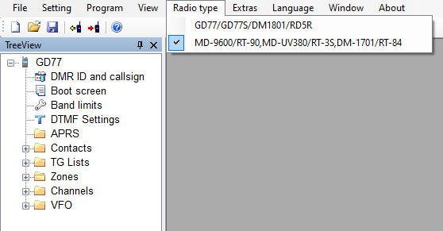
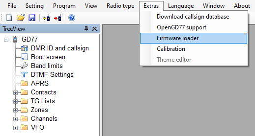
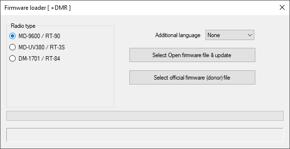
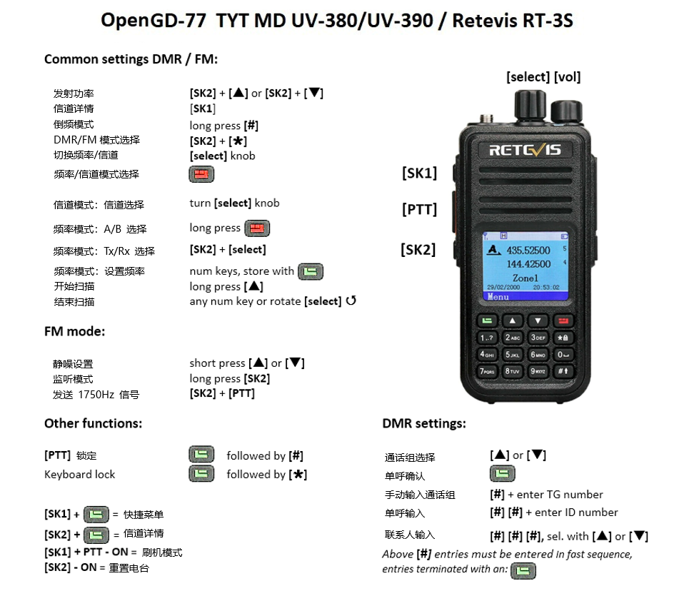
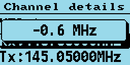
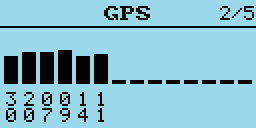
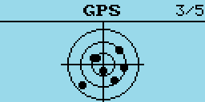
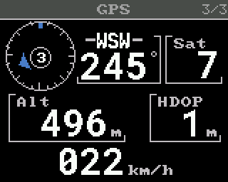

# OpenGD77 用户指南

## 适用于 OpenGD77 / OpenGD77S / OpenDM1801\* / OpenDM1801A\* / OpenRD5R / MD-9600 (RT-90) / MD-UV380 (RT-3S) / MD-UV390 / DM-1701 / RT-84

翻译：BH4ESK BH4FTP BI8DHC  
校对：BG5IPF BG7XTQ

获取最新消息或与我们讨论，请到我们的官方论坛 <https://opengd77.com>

＃ 该固件不兼容 2022 新版宝锋 DM-1801，或新版 DM-1801A #

<!-- TOC titleSize:2 tabSpaces:2 depthFrom:1 depthTo:6 withLinks:1 updateOnSave:1 orderedList:0 skip:0 title:1 charForUnorderedList:* -->

## 目录

- [OpenGD77 用户指南](#opengd77-用户指南)
  - [适用于 OpenGD77 / OpenGD77S / OpenDM1801\* / OpenDM1801A\* / OpenRD5R / MD-9600 (RT-90) / MD-UV380 (RT-3S) / MD-UV390 / DM-1701 / RT-84](#适用于-opengd77--opengd77s--opendm1801--opendm1801a--openrd5r--md-9600-rt-90--md-uv380-rt-3s--md-uv390--dm-1701--rt-84)
  - [目录](#目录)
  - [简介（Introduction）](#简介introduction)
    - [下载链接与其他资源（Download links and other resources）](#下载链接与其他资源download-links-and-other-resources)
  - [安装（Installation）](#安装installation)
    - [将数据传输到电台（Transferring data to Radio）](#将数据传输到电台transferring-data-to-radio)
  - [电台配置文件兼容性（Codeplug compatibility）](#电台配置文件兼容性codeplug-compatibility)
  - [不同电台之间的固件差异（Variations between different supported radios）](#不同电台之间的固件差异variations-between-different-supported-radios)
  - [主屏幕（频率与信道界面）（Main screens (VFO and Channel modes)）](#主屏幕频率与信道界面main-screens-vfo-and-channel-modes)
    - [在模拟与数字模式之间切换（Changing between FM mode and DMR mode）](#在模拟与数字模式之间切换changing-between-fm-mode-and-dmr-mode)
    - [在 DMR 模式下切换时隙（Changing Timeslot in DMR mode）](#在-dmr-模式下切换时隙changing-timeslot-in-dmr-mode)
    - [在 DMR 模式下自动设置通话组、单呼和时隙（Automatic setting of Talkgroup/PrivateCall and Timeslot in DMR mode）](#在-dmr-模式下自动设置通话组单呼和时隙automatic-setting-of-talkgroupprivatecall-and-timeslot-in-dmr-mode)
    - [在 FM 模式下更改带宽（Changing bandwidth in FM mode）](#在-fm-模式下更改带宽changing-bandwidth-in-fm-mode)
    - [控制发射功率（Controlling Tx power）](#控制发射功率controlling-tx-power)
    - [信号强度条（S 表）（Signal strength bar graph）](#信号强度条s-表signal-strength-bar-graph)
    - [信道界面的特殊功能（Channel screen specific functionality）](#信道界面的特殊功能channel-screen-specific-functionality)
      - [在当前区域内切换信道（Changing channels within the current zone）](#在当前区域内切换信道changing-channels-within-the-current-zone)
      - [改变区域（Changing zones）](#改变区域changing-zones)
      - [显示信道频率（Displaying the channel Frequency）](#显示信道频率displaying-the-channel-frequency)
      - [显示 FM 模式具体信道信息（Displaying FM specific channel information）](#显示-fm-模式具体信道信息displaying-fm-specific-channel-information)
      - [中继倒频功能（Reverse repeater operation）](#中继倒频功能reverse-repeater-operation)
      - [信道界面快捷菜单（Channel Quick Menu）](#信道界面快捷菜单channel-quick-menu)
        - [复制一个信道配置至 VFO（Channel --\> VFO）（Copying a channel to VFO）](#复制一个信道配置至-vfochannel----vfocopying-a-channel-to-vfo)
        - [将 VFO 信息写入当前信道（VFO --\> Channel）（Read the VFO into the current channel）](#将-vfo-信息写入当前信道vfo----channelread-the-vfo-into-the-current-channel)
        - [过滤器设置（Filter）](#过滤器设置filter)
      - [频率界面快捷菜单（VFO Quick Menu）](#频率界面快捷菜单vfo-quick-menu)
        - [选择 VFO A/B（VFO selection A or B）](#选择-vfo-abvfo-selection-a-or-b)
        - [交换接收与发射频率（Tx \<--\> Rx）（Exchange the TX and RX frequencies）](#交换接收与发射频率tx----rxexchange-the-tx-and-rx-frequencies)
        - [将接收频率复制到发射频率（Rx --\> Tx）（Copy the RX frequency to the TX frequency）](#将接收频率复制到发射频率rx----txcopy-the-rx-frequency-to-the-tx-frequency)
        - [将发射频率复制到接收频率（Tx --\> Rx）（Copy Tx frequency to the Rx frequency）](#将发射频率复制到接收频率tx----rxcopy-tx-frequency-to-the-rx-frequency)
        - [过滤器（Filter）（_仅限 DMR 模式_）](#过滤器filter仅限-dmr-模式)
        - [存储 VFO 配置至新建信道（VFO to New Channel）](#存储-vfo-配置至新建信道vfo-to-new-channel)
        - [FM 模式哑音扫描（Tone Scan for CTCSS or DCS tone in FM）](#fm-模式哑音扫描tone-scan-for-ctcss-or-dcs-tone-in-fm)
    - [与 DMR 有关的一些设置（DMR specific functionality (_VFO and Channel screens_)）](#与-dmr-有关的一些设置dmr-specific-functionality-vfo-and-channel-screens)
      - [时隙选择（Timeslot selection）](#时隙选择timeslot-selection)
      - [DMR ID、呼号与姓名显示（DMR ID callsign and name display）](#dmr-id呼号与姓名显示dmr-id-callsign-and-name-display)
      - [主叫别名显示（Talker Alias display）](#主叫别名显示talker-alias-display)
      - [从通话组列表中选择通话组（Talkgroup selection from the TG list）](#从通话组列表中选择通话组talkgroup-selection-from-the-tg-list)
      - [为联系人或通话组指定时隙（Assignment of Timeslot to Digital Contact TalkGroup）](#为联系人或通话组指定时隙assignment-of-timeslot-to-digital-contact-talkgroup)
      - [通话组反色显示（TalkGroup displayed in inverse video）](#通话组反色显示talkgroup-displayed-in-inverse-video)
      - [手动输入通话组代码（Manual TalkGroup number entry）](#手动输入通话组代码manual-talkgroup-number-entry)
      - [输入单呼号码（Private Call number entry）](#输入单呼号码private-call-number-entry)
      - [选择联系人（Digital Contact selection）](#选择联系人digital-contact-selection)
      - [临时修改您的 DMR ID（Station DMR ID number entry）](#临时修改您的-dmr-idstation-dmr-id-number-entry)
    - [与 FM 有关的一些设置（FM specific functionality (_VFO and Channel screens_)）](#与-fm-有关的一些设置fm-specific-functionality-vfo-and-channel-screens)
      - [FM 和窄带 FM（FM and FM Narrow）](#fm-和窄带-fmfm-and-fm-narrow)
      - [哑音设置（CTCSS Tone or DCS Code）](#哑音设置ctcss-tone-or-dcs-code)
      - [静噪（Squelch）](#静噪squelch)
      - [1750Hz 中继操作音（1750Hz Tone for repeater operation）](#1750hz-中继操作音1750hz-tone-for-repeater-operation)
      - [双音多频发射（DTMF tone transmission）](#双音多频发射dtmf-tone-transmission)
      - [双音多频序列输入与发射（DTMF sequence entry and transmission）](#双音多频序列输入与发射dtmf-sequence-entry-and-transmission)
      - [FM APRS 位置发射（FM APRS location transmission）](#fm-aprs-位置发射fm-aprs-location-transmission)
    - [与 VFO 有关的一些设置（VFO specific functionality）](#与-vfo-有关的一些设置vfo-specific-functionality)
      - [频率步进（Frequency change up/down step）](#频率步进frequency-change-updown-step)
      - [使用数字键输入频率（Numerical frequency entry）](#使用数字键输入频率numerical-frequency-entry)
      - [单独调整发射频率（To adjust the TX frequency, independent of the RX frequency）](#单独调整发射频率to-adjust-the-tx-frequency-independent-of-the-rx-frequency)
      - [频谱扫描（Spectrum sweep scan）](#频谱扫描spectrum-sweep-scan)
      - [VFO 双守（VFO Dual Watch）](#vfo-双守vfo-dual-watch)
      - [快速切换 VFO A 或 VFO B（Easily changing from VFO A to VFO B, and vice versa）](#快速切换-vfo-a-或-vfo-beasily-changing-from-vfo-a-to-vfo-b-and-vice-versa)
  - [监听模式（Monitor mode）](#监听模式monitor-mode)
  - [发射（Transmitting）](#发射transmitting)
    - [超时警告音（Timeout warning beep）](#超时警告音timeout-warning-beep)
    - [超时定时器（TOT）](#超时定时器tot)
  - [扫描（Scanning）](#扫描scanning)
    - [信道扫描（Channel scanning）](#信道扫描channel-scanning)
    - [频率扫描（VFO scanning）](#频率扫描vfo-scanning)
  - [其他界面（Other screens）](#其他界面other-screens)
    - [锁屏界面（Lock screen）](#锁屏界面lock-screen)
    - [文字输入界面（Text entry）](#文字输入界面text-entry)
  - [控制按键与按钮（The control keys and buttons）](#控制按键与按钮the-control-keys-and-buttons)
  - [菜单系统（The Menu System）](#菜单系统the-menu-system)
  - [快捷键（QuickKeys）](#快捷键quickkeys)
  - [主菜单（Main Menu）](#主菜单main-menu)
    - [区域（Zone）](#区域zone)
    - [信号强度指示器（RSSI）](#信号强度指示器rssi)
    - [电台信息（Radio info）](#电台信息radio-info)
      - [电池电压和百分比（Battery voltage and percentage）](#电池电压和百分比battery-voltage-and-percentage)
      - [时钟（Time clock）](#时钟time-clock)
      - [日期界面（Date screen）](#日期界面date-screen)
      - [位置界面（Location screen）](#位置界面location-screen)
      - [MCU 温度（CPU temperature）](#mcu-温度cpu-temperature)
      - [电池电压历史（Battery voltage history）](#电池电压历史battery-voltage-history)
    - [联系人（Contacts）](#联系人contacts)
      - [DMR 联系人（DMR Contacts）](#dmr-联系人dmr-contacts)
      - [FM DTMF 联系人（FM DTMF Contacts）](#fm-dtmf-联系人fm-dtmf-contacts)
      - [新联系人（New Contact）](#新联系人new-contact)
    - [回溯界面（Last Heard）](#回溯界面last-heard)
    - [固件信息和致谢名单（Firmware Info and credits）](#固件信息和致谢名单firmware-info-and-credits)
    - [选项设置（General Options）](#选项设置general-options)
      - [按键长按时间（Key long）](#按键长按时间key-long)
      - [按键重复速度（Key rpt）](#按键重复速度key-rpt)
      - [自动锁定（Auto lock）](#自动锁定auto-lock)
      - [热点模式（Hotspot）](#热点模式hotspot)
      - [温度校准（Temp Cal）](#温度校准temp-cal)
      - [电池校准（Batt Cal）](#电池校准batt-cal)
      - [时间校准（Time Cal）](#时间校准time-cal)
      - [省电等级（Eco Level）](#省电等级eco-level)
      - [睡眠（Suspend）](#睡眠suspend)
      - [安全开机（Safe Power On）](#安全开机safe-power-on)
      - [自动关机（Auto Power Off）](#自动关机auto-power-off)
      - [带有射频的自动关机（APO with RF）](#带有射频的自动关机apo-with-rf)
      - [卫星跟随模式（Satellite follow mode）](#卫星跟随模式satellite-follow-mode)
      - [全球定位系统（GPS）](#全球定位系统gps)
    - [无线电选项（Radio Options）](#无线电选项radio-options)
      - [频段限制（Band Limits）](#频段限制band-limits)
      - [过滤器保持时间（Filter time）](#过滤器保持时间filter-time)
      - [扫描延迟（Scan delay）](#扫描延迟scan-delay)
      - [扫描驻留（Scan dwell）](#扫描驻留scan-dwell)
      - [扫描模式（Scan mode）](#扫描模式scan-mode)
      - [开机扫描（Scan on Boot）](#开机扫描scan-on-boot)
      - [_xxx_ 静噪（_xxx_ Squelch）](#xxx-静噪xxx-squelch)
      - [PTT 保持（PTT Latch）](#ptt-保持ptt-latch)
      - [允许单呼（Allow PC）](#允许单呼allow-pc)
      - [用户功率（User Power）](#用户功率user-power)
      - [DMR 循环冗余检查（DMR crc）](#dmr-循环冗余检查dmr-crc)
    - [显示设置（Display Options）](#显示设置display-options)
      - [背光亮度（Brightness）](#背光亮度brightness)
      - [夜间亮度（Nite Bright）](#夜间亮度nite-bright)
      - [待机亮度（Min Bright）](#待机亮度min-bright)
      - [对比度（Contrast）](#对比度contrast)
      - [背光模式（Mode）](#背光模式mode)
      - [背光延时（Timeout）](#背光延时timeout)
      - [显示颜色模式（Screen）](#显示颜色模式screen)
      - [自动夜间模式（Auto night）](#自动夜间模式auto-night)
      - [联系人显示顺序（Order）](#联系人显示顺序order)
      - [联系人显示方式（Contact）](#联系人显示方式contact)
      - [电量（单位）](#电量单位)
      - [信息（Info）](#信息info)
      - [LED 灯（LEDs）](#led-灯leds)
      - [时区（Timezone）](#时区timezone)
      - [时间显示格式（Time (display format)）](#时间显示格式time-display-format)
      - [显示距离（Show dist）](#显示距离show-distance)
    - [声音设置（Sound Options）](#声音设置sound-options)
      - [超时警告（Timeout beep）](#超时警告timeout-beep)
      - [警告音量（Beep volume）](#警告音量beep-volume)
      - [DMR 提示音（DMR Beep）](#dmr-提示音dmr-beep)
      - [接收提示音（RX Beep）](#接收提示音rx-beep)
      - [通话者（Talker）](#通话者talker)
      - [DMR 麦克风增益（DMR mic）](#dmr-麦克风增益dmr-mic)
      - [FM 麦克风增益（FM mic）](#fm-麦克风增益fm-mic)
      - [VOX 阈值（VOX threshold）](#vox-阈值vox-threshold)
      - [VOX 延迟（VOX Tail）](#vox-延迟vox-tail)
      - [提示音（Prompt）](#提示音prompt)
      - [DMR 接收自动增益控制（DMR Rx AGC）](#dmr-接收自动增益控制dmr-rx-agc)
      - [咔嗒声抑制（Click suppr）](#咔嗒声抑制click-suppr)
    - [校准界面（Calibration screen）](#校准界面calibration-screen)
      - [频率校准（Cal Freq）](#频率校准cal-freq)
      - [功率校准（Cal Power）](#功率校准cal-power)
      - [功率调整（Power Adjust）](#功率调整power-adjust)
      - [频率调整（Freq Adjust）](#频率调整freq-adjust)
      - [工厂校准（Factory Cal）](#工厂校准factory-cal)
      - [校准步骤（Calibration Procedure）](#校准步骤calibration-procedure)
    - [主题选项（Theme Options）](#主题选项theme-options)
      - [主题选择器（Theme Chooser）](#主题选择器theme-chooser)
      - [主题选项（Theme Options）](#主题选项theme-options-1)
      - [颜色选择器（Colour Picker）](#颜色选择器colour-picker)
      - [可用主题项目（Here is the detailed list of the theme items）](#可用主题项目here-is-the-detailed-list-of-the-theme-items)
    - [APRS选项（APRS Options）](#APRS选项aprs-options)
      - [信标模式（Mode）](#信标模式beaconing-mode)
      - [信标来源（Location）](#信标来源beaconing-location)
      - [信标间隔（Interval）](#信标间隔beaconing-initial-interval)
      - [信标衰减（Decay）](#信标衰减beaconing-decay-algorithm)
      - [信标压缩（Compress）](#信标压缩beaconing-compression)
      - [智能信标（SmartBeaconing&trade;）](#智能信标smartbeaconing)
         - [低速速率（Slow Rate）](#低速速率slow-rate)
         - [高速速率（Fast Rate）](#高速速率fast-rate)
         - [低速设置（Low Speed）](#低速设置low-speed)
         - [高速设置（Hi Speed）](#高速设置high-speed)
         - [转弯角度设置（Turn Angle）](#转弯角度设置turn-angle)
         - [转弯斜率设置（Turn Slope）](#转弯斜率设置turn-slope)
         - [航向时间设置（Turn Time）](#航向时间设置turn-time)
    - [信道详细设置（Channel Details）](#信道详细设置channel-details)
      - [信道名称（Channel name）](#信道名称channel-name)
      - [接收频率（RX）](#接收频率rx)
      - [发射频率（TX）](#发射频率tx)
      - [中继频差（Repeater Shifts）](#中继频差repeater-shifts)
      - [模式（Mode）](#模式mode)
      - [DMR ID](#dmr-id)
      - [色码（Color Code）](#色码color-code)
      - [时隙（Timeslot）](#时隙timeslot)
      - [通话组列表（TG Lst）](#通话组列表tg-lst)
      - [联系人（Contact）](#联系人contact)
      - [接收哑音（Rx CSS (CTCSS or DCS)）](#接收哑音rx-css-ctcss-or-dcs)
      - [发射哑音（Tx CSS (CTCSS or DCS)）](#发射哑音tx-css-ctcss-or-dcs)
      - [带宽（BW）](#带宽bw)
      - [步进（Step）](#步进step)
      - [超时定时器（TOT）](#超时定时器tot-1)
      - [仅接收（Rx Only）](#仅接收rx-only)
      - [跳过区域（Zone Skip）](#跳过区域zone-skip)
      - [跳过信道（All Skip）](#跳过信道all-skip)
      - [声控发射（VOX）](#声控发射vox)
      - [信道功率（Ch Power）](#信道功率ch-power)
      - [信道静噪（Squelch (Channel)）](#信道静噪squelch-channel)
      - [信道提示音（Beep (Channel)）](#信道提示音beep-channel)
      - [信道省电（Eco (Channel)）](#信道省电eco-channel)
      - [主叫别名发射 时隙*x*（TA Tx TS*x*）](#主叫别名发射-时隙xta-tx-tsx)
      - [APRS（APRS Channel）](#aprs-channel)
      - [保存对信道的更改（Accepting and saving the changes to the channel）](#保存对信道的更改accepting-and-saving-the-changes-to-the-channel)
    - [语言界面（Language Screen）](#语言界面language-screen)
    - [卫星界面（Satellite Screen）](#卫星界面satellite-screen)
      - [极坐标图（Polar view）](#极坐标图polar-view)
      - [卫星独立预测界面（Satellite individual predictions screen）](#卫星独立预测界面satellite-individual-predictions-screen)
      - [卫星实时数据界面（Satellite live data screen）](#卫星实时数据界面satellite-live-data-screen)
      - [静噪和功率设置（Squelch and Power settings）](#静噪和功率设置squelch-and-power-settings)
      - [卫星闹钟（Satellite alarm）](#卫星闹钟satellite-alarm)
      - [CPS 集成（CPS Integratione）](#cps-集成cps-integratione)
      - [技术说明（Technical notes）](#技术说明technical-notes)
    - [GPS 界面（GPS Screen）](#gps-界面gps-screen)
  - [发起或接收单呼（Making and receiving DMR Private Calls）](#发起或接收单呼making-and-receiving-dmr-private-calls)
    - [想要发起单呼的话（To make a Private Call）](#想要发起单呼的话to-make-a-private-call)
    - [当接收到一个单呼时（To Receive a Private Call）](#当接收到一个单呼时to-receive-a-private-call)
  - [热点模式（Hotspot mode）](#热点模式hotspot-mode)
  - [重设电台各项设置（Resetting the Settings）](#重设电台各项设置resetting-the-settings)
  - [MD-730 的操作方式（GD-77S operation）](#md-730-的操作方式gd-77s-operation)
    - [MD730 信道/通话组模式（GD77S Channel / TG mode）](#md730-信道通话组模式gd77s-channel--tg-mode)
    - [MD730 扫描模式（GD77S Scan mode）](#md730-扫描模式gd77s-scan-mode)
    - [MD730 时隙模式（GD77S Timeslot mode）](#md730-时隙模式gd77s-timeslot-mode)
    - [MD730 色码模式（GD77S Color Code mode）](#md730-色码模式gd77s-color-code-mode)
    - [MD730 DMR 过滤模式（GD77S DMR Filter mode）](#md730-dmr-过滤模式gd77s-dmr-filter-mode)
    - [MD730 区域模式（GD77S Zone mode）](#md730-区域模式gd77s-zone-mode)
    - [MD730 功率模式（GD77S Power mode）](#md730-功率模式gd77s-power-mode)
  - [MD9600 和 RT90 的操作方式（MD-9600 and RT-90 specific）](#md9600-和-rt90-的操作方式md-9600-and-rt-90-specific)
  - [客户编程软件（CPS software）](#客户编程软件cps-software)
    - [概述（Overview）](#概述overview)
      - [新驱动安装（New Driver Installation）](#新驱动安装new-driver-installation)
      - [OpenGD77 菜单（OpenGD77 Menu）](#opengd77-菜单opengd77-menu)
      - [在您做任何其他事情之前备份（Backup Before You Do Anything Else）](#在您做任何其他事情之前备份backup-before-you-do-anything-else)
      - [读写您的电台配置文件（Reading and Writing Your Codeplug）](#读写您的电台配置文件reading-and-writing-your-codeplug)
      - [写入 DMR ID 用户数据库（Writing DMR IDs -- the User Database）](#写入-dmr-id-用户数据库writing-dmr-ids----the-user-database)
      - [开机铃声（Boot tune）](#开机铃声boot-tune)
        - [莫尔斯电码开机铃声（Boot Tune in Morse code）](#莫尔斯电码开机铃声boot-tune-in-morse-code)
        - [旋律和音符（Melodies and Notes）](#旋律和音符melodies-and-notes)
      - [开机图像（Boot Image）](#开机图像boot-image)

## 简介（Introduction）

本用户指南和固件一样正在开发中。

当固件的某一部分稳定后，图片与内容会重新更新。

本项目的目的旨在开发一个功能齐全的、非商用的固件，以代替出厂固件。
该固件专为**业余无线电**用户使用打造，同时含有一些官方固件所没有的功能。

*注意：*

- **本固件依然处于开发阶段，仍有一些官方固件支持的关键功能在本固件内不被支持。**

- 短信息发送与接收功能**目前暂时不支持**，但有可能在将来会被支持。

- **不支持**扫描列表功能，因为信道扫描或区域扫描功能提供了几乎相同的功能。

- 隐私与加密功能**将永远不会**被支持，因为对于业余电台使用该功能是非法的行为。在某些国家或地区（例如澳大利亚），由于政府与法律要求，开发者被要求在任何加密系统中植入后门，实际上让开发一个含有加密的系统变得违法或者不可能。

### 下载链接与其他资源（Download links and other resources）

**Donor File**

由于软件许可的原因，OpenGD77固件需要结合原始制造商固件的部分，以提供对 AMBE 编码的支持。根据电台型号您需要下载以下两个文件之一，将其存储在计算机上，并记下其位置。

**GD-77 | GD-77S | DM-1801 | DM-1801A | RD-5R**
<https://radioddity.s3.amazonaws.com/2021-01-26%20GD-77%20CPS%20%26%20Firmware%20Changelog%20-%20Ham%20Version.zip>

解压缩固件 Zip 文件，从“firmware software V4.3.6”文件夹中提取 GD-77_V4.3.6.sgl 文件，并将其保存到您的计算机中。  

**TYT MD-9600 | Retevis RT-90 | TYT MD-UV380 | Retevis RT-3S | Baofeng DM-1701 | Retevis RT-84**
<https://www.passion-radio.com/index.php?controller=attachment&id_attachment=760>

解压缩固件 Zip 文件，提取文件 MD9600-CSV（2571V5）-V26.45.bin 并将其保存到您的计算机中。

**二进制固件:**

**GD-77 | GD-77S | DM-1801 | DM-1801A | RD-5R**
<https://www.opengd77.com/downloads/GD77/Firmware/Latest>

**特易通 MD-9600 | Retevis RT-90**
<https://www.opengd77.com/downloads/MD9600/Firmware/Latest>

MD-9600 | RT-90 在生产过程中使用了多种不同的 PLL 和 IF 芯片。
您需要安装与您的硬件版本匹配的版本，该版本写在电台顶部的 PCB 上，尽管有时 特易通 更改硬件而不更改 PCB 上的版本。
对于硬件版本为 4A 的电台，请使用版本 5 固件。
对于在 PCB 上写有硬件版本 2 的非常旧的电台，可能需要加载版本 1 固件。

如果您加载了错误的固件版本，并不会对电台造成任何伤害。但是，电台将无法接收或发送。
因此，如果您的电台无法接收或发射，请尝试使用不同的固件硬件版本。

**特易通 MD-UV380 | Retevis RT-3S | 宝锋 DM-1701 | Retevis RT-84**
<https://www.opengd77.com/downloads/MDUV380_DM1701/Firmware/Latest/>

请注意：名称中带有 JA 的版本是为日本用户本地化的，仅支持日语和英语。

- **OpenGD77 客户编程软件（CPS 即写频软件）:**
  <https://www.opengd77.com/downloads/PC_CPS_20230910/Latest>

- **已发布的固件的最新源代码：**
  <https://www.opengd77.com/downloads/releases>

- **OpenGD77 论坛:**
  <https://www.opengd77.com/>

## 安装（Installation）

本固件可以被安装在以下几部电台：

- 特易通 MD-760 （又名 Radioddity GD-77）
- 特易通 MD-730 （又名 Radioddity GD-77S）
- 宝锋 DM-1801（仅限第 1 版硬件） （又名 宝锋 DM-860）
- 宝锋 DM-1801A（仅限第 1 版硬件）
- 宝锋 DM-5R Tier II （又名 宝锋 RD-5R）
- 特易通 MD-9600 | Retevis RT-90
- 特易通 MD-UV380 | Retevis RT-3S | 宝锋 DM-1701 | Retevis RT-84

固件文件必须使用 OpenGD77 CPS 中的 “Extras/Firmware Loader”（“附加/固件加载程序”）菜单安装。原厂提供的固件更新工具不能用于刷入 OpenGD77 固件。

安装本固件的风险由用户自行承担。**请在刷入固件后立即使用 OpenGD77 CPS 对电台进行完整备份**（详见*[备份](#在您做任何其他事情之前备份backup-before-you-do-anything-else)*，如果遇到任何问题，原厂固件通常可以被重新刷入。

*注意：*

- _该固件与宝锋 DM-1801 的新 2022 版本或 DM-1801A 不兼容，因为其使用了完全不同的内部硬件和电子设备。_
- 原厂提供的 CPS 软件与本固件不兼容，请使用 **OpenGD77 CPS**。它可以从本指南的[1.1 章节处](#下载链接与其他资源download-links-and-other-resources)下载。包括宝锋、特易通、Retevis 和其他支持的电台必须使用 OpenGD77 CPS。

### 将数据传输到电台（Transferring data to Radio）

为了安装固件、读写电台配置文件、写入卫星数据、语音提示和 DMR ID 数据库，您必须使用 CPS。

1.  固件更新模式

- 通过以下方式使电台进入固件更新模式：

  - 按住如下所示的两个按键（**S1**,**Fn**）并打开电台。
    - 特易通 MD-760、MD-730 或 Radioddity GD-77、GD-77s：
      - 按住 PTT 按键旁边的**两个小按键**。
    - 宝锋 DM-1801 或 DM-1801A 或 DM-860：
      - 按住 PTT 按键下方的**两个小按键**。
    - 宝锋 DM-5R Tier II 或 RD-5R：
      - 按住橙色 **S1**（Call）和黑色 Fn（**Moni** 或 **S2**）按键（PTT 两侧的按键）。
    - 特易通 MD-9600 | Retevis RT-90
      - 按住 **P1** 和橙色按键，同时为电台提供 12V 电源。注意：更新 OpenGD77 固件时不需要断开电源并重新连接，只需在按住 **P1** 和橙色按键的同时，使用 **绿色/电源** 键开机即可进入固件更新模式。
    - 特易通 MD-UV380 | Retevis RT-3S | 宝锋 DM-1701 | Retevis RT-84
      - 按住电台侧面顶部的 2 个按键（**S1** 和 PTT）并打开电台。

<!-- { width=420 } -->

- 此时 LCD 屏幕将不显示任何内容。手持电台的 LED 将亮起或闪烁。

- 对于 GD-77 | GD-77S | DM-1801 | DM-1801A 和 DM-5R，不需要安装驱动程序。
  对于所有其他电台，需要安装 STM DFUSe 驱动程序。如果 Windows 没有自动安装驱动程序，您可能需要使用 Windows 设备管理器来查找并安装正确的驱动程序。

- 选择电台类型  
  

- 固件可从 [CPS](#客户编程软件cps-software) 中的 Extras 菜单轻松刷入。  
  <!-- { width=400 } -->

  - 选择您的电台型号。  
    <!-- { width=420 } -->  
    <!-- { width=420 } -->

  - 出于软件许可的原因，首次使用固件加载器时，您必须点击 “Select official firmware (donor) file” 并按提示进行操作。

    该操作只需执行一次。如果您不这样做就只能在模拟模式下使用电台。

    **请注意！不要尝试将原厂固件刷入电台，CPS 只需要用它给本固件增加 DMR 功能。**

    成功完成此过程后，固件加载程序的标题栏将显示 \[+DMR]
  - 固件可以选择性地支持附加语言。如果需要，请在 “Additional Language” 下拉菜单中选择
  - 点击 “Select Open firmware file & Update” 或 “Select a File and Update”
  - 选择之前下载的 .zip 固件文件。（最新的文件可以在[1.1 章节处](#下载链接与其他资源download-links-and-other-resources)给出的下载位置找到）
    所选固件文件将使用官方固件中的数据进行修补，然后与所选的附加语言一起刷入电台。

  - 刷机完成后，如果电台没有自动重启，请关闭电源并重新打开。

**请注意！ 固件不支持除 GD-77 以外的所有电台使用的原版电台配置文件格式，因此您需要使用 CPS 安装 OpenGD77 格式的电台配置文件，然后才能使用电台的其他功能，VFO 除外（它可以手动更改）**

1.  使用 [OpenGD77 CPS](#客户编程软件cps-software) 更新电台配置文件（Codeplug）。

- 此步骤使用串口通信，电台需要正常开机且屏幕处于工作状态。

  - 如果您在更新固件，请完全关闭电台再开机。

  - 它使用串口通信，因此必须安装 OpenGD77 驱动程序。在安装 CPS 软件时将会一同安装。

  - 具体细节详见 [CPS 部分](#客户编程软件cps-software)。

## 电台配置文件兼容性（Codeplug compatibility）

本固件所使用的电台配置文件与官方的略有不同。

为了能完整使用 OpenGD77 的功能，我们建议您使用 OpenGD77 CPS 为无线电编写一个新的配置文件

除了 MD760 以外，所有电台用户需要使用 Colin G4EML 编写的工具转换原厂的配置文件格式。（参见 <http://www.gb3gf.co.uk/downloads.html>）

OpenGD77 CPS 可以导入已经存在的 CSV 格式配置文件。

电台配置文件只能使用 [OpenGD77 CPS](#客户编程软件cps-software) 写入到电台。

我们还推荐您重新构建您的电台配置文件，删除频率重复但通话组不同的信道。更多信息请参阅本指南末尾的[为本固件写入信道与通话组](#概述overview)。

## 不同电台之间的固件差异（Variations between different supported radios）

不是所有受支持的电台都有相同的按键数或屏幕大小，因此操作这些电台会与操作特易通 MD760 有些不同之处。

此外，并不是所有的电台都支持全部的功能。

- 特易通 MD-760（又名 Radioddity GD-77），在 PTT 下方有 2 个按键。**黑色**按键在又称为**SK1**，**蓝色**按键称为**SK2**，在本手册中也称其为**功能**按键。 此电台顶部还有一个**橙色**按键。

- 宝锋 DM-5R | RD-5R 的硬件不支持在电台发射时通过 USB 进行通讯，所以热点模式在这部电台上**无法**使用。

- 宝锋 DM-5R | RD-5R 没有左右方向键，由 **A/B** 和 **Band** 按键代替**左**方向键和**右**方向键。

- 宝锋 DM-5R | RD-5R 没有橙色按键，该功能由**长按**橙色的 **MR/VFO** 代替。

- 宝锋 DM-5R | RD-5R 有两个侧键，但是其位置与 MD760 和 DM1801 不同，位于 PTT 上方的是 MD760 上的**黑色**按键（或称为 **SK1**），位于 PTT 下方的是 MD760 上的 **蓝色**按键（或称为 **SK2**）。

- 特易通 MD-730 没有键盘或者屏幕，因此操作方式与其他有屏幕的电台完全不同。（_见附录 [MD-730 的操作方式](#md-730-的操作方式gd-77s-operation)_）

- 宝锋 DM-1801 | DM-860 有独立的 **MR/VFO** 按键，可用于切换信道/频率模式，而不需要使用**红色**的菜单键。

- 宝锋 DM-1801 | DM-860 也有独立的 **A/B** 按键，用于切换 VFO A/B，而不需要使用电台顶部的**橙色**按键进入快捷菜单再切换。

- 特易通 MD-UV380 | Retevis RT-3S 没有左右方向键，但在电台顶部有一个旋钮。在频率和信道界面上，**上下**方向键的功能类似于 GD-77 上的左右方向键。旋钮的功能类似于 GD-77 上的**上下**方向键，可用于更改频率或信道。

- 宝锋 DM-1701 | Retevis RT-84 没有左右方向键，P1 用作左方向键，P2 用作右方向键。**橙色**按键位于 PTT 上方。

在菜单界面中，上下方向键用于上下移动，旋钮用于控制每个设置的值，与 GD-77 上的左右方向键的作用相同。

- 特易通 MD-9600 | Retevis RT-90 是一款移动电台，前面板上有按键和麦克风。有关按键映射的信息，请参阅有关 MD-9600 的部分。

## 主屏幕（频率与信道界面）（Main screens (VFO and Channel modes)）

本固件有两个主屏幕：频率界面（VFO）与信道界面（Channel）。这与原装固件的界面类似，但拥有了更多功能。

在本固件安装完成后，默认显示频率界面。

频率界面显示的发射与接收频率会从电台配置文件中的“_VFO A_”配置读取。

无论在频率界面或信道界面，当前模式（**DMR** 或 **FM**）都会显示在屏幕左上角，电量百分比会显示在右上角。

在 **DMR** 模式中，当前*时隙*会显示在 **DMR** 右侧，例如时隙 2 会显示为 “**TS2**”，*色码*会显示在电池左侧，例如色 1 会显示为 “**C1**”，当时隙过滤关闭时，“**TS1**” 或 “**TS2**” 指示器会反色显示。

当前的发射功率会显示在屏幕顶部中间（例如 “750mW”）。

在**频率**界面，发射与接收频率都会显示，当处于 DMR 模式的时候，通话组也会同时显示。

**R**（接收频率）左侧的小箭头表示当前控制的是接收频率，使用**上下**方向键或数字键可以改变接收频率。

信道界面会在顶部显示与频率界面相同的内容，中间则显示**信道名称**（此处为“**_Lee Hill_**”）与**区域**（此处为“**_Home DMR_**”）。

在 DMR 模式下还会显示**通话组**（此处为“**_ColoradoHD_**”）。

在这两个界面中:

- 按压**红色**菜单按键可以在频率界面与信道界面之间切换。（*注意：* 在宝锋 DM-1801 和 DM-5R 上，按压 **MR/VFO** 按键以切换频率/信道界面。）

- 按压**绿色**菜单按键进入菜单选项。

- 按压**蓝色+绿色**组合键快速进入[信道详情](#信道详细设置channel-details)界面，该界面同样可以从菜单进入。

*注意：*

- VFO 实际上是一种特殊的信道，因此[信道详情](#信道详细设置channel-details)界面同样适用于频率界面。

### 在模拟与数字模式之间切换（Changing between FM mode and DMR mode）

按压**蓝色+星号**组合键可以在 FM 和 DMR 模式之间切换，该操作适用于任意频率或信道界面。

### 在 DMR 模式下切换时隙（Changing Timeslot in DMR mode）

在 DMR 模式下，按压**星号**按键以切换*时隙 1*与*时隙 2*并将其设置为临时时隙。

要清除临时时隙，请长按**星号**按键。

### 在 DMR 模式下自动设置通话组、单呼和时隙（Automatic setting of Talkgroup/PrivateCall and Timeslot in DMR mode）

在 DMR 模式下，如果 DMR 过滤器被关闭，即使通话组**不在**通话组列表中或未定义为信道的联系人，也可以在接收时自动将电台设置为正确的通话组：

- 在接收时，按压 SK2 按键一次，电台会自动设置通话组覆盖。

*注意：*

- 如果时隙过滤器处于关闭状态，它也会被覆盖。

要清除覆盖，参见[在 DMR 模式下切换时隙](#在-dmr-模式下切换时隙changing-timeslot-in-dmr-mode)和[手动输入通话组号码](#手动输入通话组代码manual-talkgroup-number-entry)部分。

### 在 FM 模式下更改带宽（Changing bandwidth in FM mode）

- 在 FM 模式下，按压**星号**按键可在 25kHz 和 12.5kHz 带宽之间切换。

### 控制发射功率（Controlling Tx power）

固件主要有两种控制输出功率的方法：

1. **主**功率控制，控制两个 VFO 以及所有信道的功率。

2. **信道**自定义功率。

默认情况下，所有信道使用**主**功率设定，但是可以在 CPS（以及**信道详情**界面）中更改此设置，以使各个信道有自己的功率设置。

当信道有自定义功率设置时，功率将以**粗体**显示。

在有自定义功率的信道上增加或减少功率是临时的，此更改不会保存到配置文件。因此，更换信道后临时功率设置会丢失。

要对信道自定义功率进行**永久**更改，您必须打开 **[信道详情（Channel Details）](#信道详细设置channel-details)** 界面，然后按压**蓝色+绿色**组合键。

在一个使用**主**功率设置的信道上更改功率，会使得其他使用主信道功率的**所有信道**和**VFO**都改变其功率。

更改**任一** VFO 的功率也会更改**主**功率设置。

- 按压**蓝色+右**组合键以增加功率。

- 按压**蓝色+左**组合键以减小功率。

功率可以被设置为以下几档：**50mW**、**250mW**、**500mW**、**750mW**、**1W**、**2W**、**3W**、**4W**、**5W** 以及 **+W-**。
MD-9600 的功率输出更高，功率设置也不同。

选择 **+W-** 功率档时，功放芯片将以用户电平驱动，该电平可以在选项菜单中更改。

默认情况下，该电平为芯片的极限值，这将使得电台产生其最大标识功率。

**该功率仅为供应急使用而设计，使用该功能可能会导致功放芯片损坏。**

如果将用户电平设置为较低的值，电台会输出非常小的功率，例如小于 50mW。
有关详细信息，请参阅用户功率设置菜单。

要选择 **+W-** 功率档位，首先选择最大功率档位，然后长按**蓝色+右**组合键。

*注意：*

- 功率输出有且只有在您校准了手中的电台之后才准确，而这些电台**在出厂时似乎没有进行非常精确的功率校准**。

- 低于 **1W** 设置的功率输出 **不是** 非常准确，因为校准仅包含 **1W** 和 **5W** 的数据。

- 在 **1W** 和 **5W** 之间，功放场效应管输出功率与功放驱动电平大致成正比，因此电台的 **2W**、**3W**、**4W** 输出功率*大致准确*。

- 但是，在 **1W** 以下，功放场效应管输出功率**与功放驱动电平不成正比**，并且在不同电台之间**有很大差异**。因此，**1W** 以下的功率精度最多只有 **80% 左右**。

- 此外，功放场效应管的最小工作功率阈值非常接近（或有时甚至高于）**50mW**，因此在此功率水平下工作**会产生不需要的杂散发射**。

- 在使用 **50mW** 功率**之前**请确认您的功率输出和发射频谱，因为它可能会造成干扰。

### 信号强度条（S 表）（Signal strength bar graph）

在 FM 与 DMR 模式中，接收信号的强度表现为横跨屏幕一个条形图（S 表）。

S 表指示在**最右端**时大约为 **S9+40dB**。

在 DMR 模式中，只有当硬件检测到 DMR 信号时 S 表**才会工作**。

在 FM 模式中，S 表应一直工作。

*注意：*

- 目前，S 表读数**不是**非常准确，因为电台硬件的接收灵敏度**没有经过校准**。

- 因此显示的值是基于一台有平均灵敏度的电台进行校准的，不同的电台可能**或多或少**偏离平均值，因此 S 表读数将**高于或低于**绝对正确值。

### 信道界面的特殊功能（Channel screen specific functionality）

信道界面显示了当前信道号码（Channel number）与当前区域（Zone）。

#### 在当前区域内切换信道（Changing channels within the current zone）<!-- linebreak -->

- 按压**上**或**下**方向键可以在当前区域内改变信道，信道号会显示在区域号旁边。

#### 改变区域（Changing zones）<!-- linebreak -->

- 按压**蓝色+上**或**蓝色+下**组合键分别可以切换上一个/下一个区域。

#### 显示信道频率（Displaying the channel Frequency）<!-- linebreak -->

- 在 FM 与 DMR 模式中，您都可以按住**黑色**侧键以显示接收与发射频率。

#### 显示 FM 模式具体信道信息（Displaying FM specific channel information）

- 在 FM 模式中，按住**黑色**侧键以显示哑音以及静噪设置。

#### 中继倒频功能（Reverse repeater operation）

- 信道模式：按住 **#** 键，频道的发射和接收频率将被交换。信道名称将以反相显示。
- 频率模式：按住 **SK1** 和 **SK2** 键，频率的发射和接收频率将被交换。
- 即使信道或区域发生变化，电台仍会保持锁定在中继倒频模式。
- 要退出中继倒频模式，请按住 **#** 键。  

**注意：** 此功能与信道的 [脱网功能（Talkaround）](#脱网功能Talkaround) 相互排斥

#### 信道界面快捷菜单（Channel Quick Menu）<!-- linebreak -->

- 按压机器顶部**橙色**按键可以调出信道界面的快捷菜单。在该菜单下**橙色**按键和**绿色**按键具有相同的功能，都可以确认当前选项。

*注意：*

- 宝锋 DM-5R 和 MD-UV380 没有顶部的**橙色**按键。

宝锋 DM-5R 请长按橙色的 **MR/VFO** 按键以访问该快捷菜单。
特易通 MD-UV380 请按 **SK1+绿色** 组合键。

##### 复制一个信道配置至 VFO（Channel --> VFO）（Copying a channel to VFO）<!-- linebreak -->

- 按压**橙色**按键，或按压**绿色**按键以复制当前信道配置至频率界面。

##### 将 VFO 信息写入当前信道（VFO --> Channel）（Read the VFO into the current channel）<!-- linebreak -->

- 按压**橙色**按键，或按压**绿色**按键以确认，按压**红色**按键以取消。

##### 过滤器设置（Filter）

- FM 模式的**过滤器**设置（哑音）

  - 使用**右**方向键或者**左**方向键以开启或关闭哑音

- DMR 模式的**过滤器**设置

  - 使用**右**方向键或者**左**方向键以选择：

    - **None**：不过滤，用于监听任何频率活动（**混杂**模式）

    - **TG**：按选中的*通话组*过滤

    - **Ct**：按电台配置文件中的*单呼联系人*过滤

    - **TGL**：按通话组列表中的*通话组*过滤组呼

  启用过滤时，屏幕中间上方的“_DMR_”指示器会反色显示。

- **CC 扫描**（_仅限 DMR 模式_）（以前称为 **CC 过滤器**）

  即使色码未知，此设置也允许电台接收 DMR 信号。

  **但该设置实际上并未禁用色码过滤器**，因为 HR-C6000 芯片不支持在未指定色码的情况下接收 DMR 信号。

  禁用色码过滤器的功能由 Colin G4EML 编写的软件算法执行，其中 HR-C6000 中设置的色码值会在接收到每个 DMR 时隙帧后改变，直到 HR-C6000 报告接收的 DMR 信号的色码与 HR-C6000 中设置的色码相同。

  此功能**不**应用于正常操作，色码匹配检测速度较慢，并且会导致 DMR 信号在算法找到色码之前无法正确接收。

  - 使用**右**方向键或**左**方向键以开关该功能。

  启用*色码*扫描时，屏幕上的*色码*指示会反色显示。

- **时隙过滤（TS Filter）**（_仅限 DMR 模式_）

  控制电台是否按*时隙*过滤。

  - 使用**右**方向键或**左**方向键以开关该功能。

  关闭*时隙*过滤时，屏幕上的时隙指示会反色显示。

  *注意：* 此功能实际上并未禁用过滤器，因为 HR-C6000 芯片不完全支持同时在两个时隙上接收信号。

  此功能使用 Daniel F1RMB 编写的软件算法，该算法最初在两个时隙上同时监听主叫 ID 数据，当一个时隙上出现有效数据时，固件就在该时隙上监听。

  如果在大约 2.5 秒内接收到的时隙上不存在主叫方 ID ，则算法会检查另一个时隙，并在主叫方 ID 数据出现时切换到该时隙。

##### 脱网功能（Talkaround）<!-- linebreak -->

启用后，TX 频率将设置为 RX 频率，因此您将能够在单工模式下在中继器的频率输出上进行传输

*注意:*

- 仅当当前信道有频差设置时，此选项才可用。
- 此选项与 [中继倒频功能（Reverse repeater operation）](#中继倒频功能reverse-repeater-operation) 互斥。

##### 距离排序（Dist sort）<!-- linebreak -->

如果设置了电台位置 ([位置屏幕](#位置屏幕location-screen) 或 安装了 GPS)， 则当前区域将按距离升序排序。 距离（以公里为单位）显示在区域名称的右侧。
当然，要做到这一点，必须使用 CPS 在相关信道上设置中继位置信息。

*注意：*
- All Channels zone 不会排序.
- 可以显示与中继的距离但不排序, 参照 **Display option** [显示距离（Show dist）](#显示距离show-distance).

#### 频率界面快捷菜单（VFO Quick Menu）<!-- linebreak -->

- 在频率界面，按压机器顶部的**橙色**按键进入快捷菜单，目前该菜单有五个选项。

*注意：*

- 宝锋 DM-5R 没有顶部的**橙色**按键，请长按橙色的 **MR/VFO** 按键以访问该快捷菜单。

##### 选择 VFO A/B（VFO selection A or B）<!-- linebreak -->

- 在频率界面，按压两次**橙色**按键以在 **VFO A** 和 **VFO B** 中快速切换。

- 在宝锋 DM-1801 | DM-860 上，该功能由按压一次 **A/B** 按键实现。

- 长按**红色**按键也会从 **VFO A** 更改为 **VFO B**，反之亦然。

##### 交换接收与发射频率（Tx <--> Rx）（Exchange the TX and RX frequencies）<!-- linebreak -->

该功能即倒频功能。

- 按压**绿色**或**橙色**按键以确认。

##### 将接收频率复制到发射频率（Rx --> Tx）（Copy the RX frequency to the TX frequency）<!-- linebreak -->

将接收频率复制到发射频率。

- 按压**绿色**或**橙色**按键以确认。

##### 将发射频率复制到接收频率（Tx --> Rx）（Copy Tx frequency to the Rx frequency）<!-- linebreak -->

将发射频率复制到接收频率。

- 按压**绿色**或**橙色**按键以确认。

##### 过滤器（Filter）（_仅限 DMR 模式_）<!-- linebreak -->

该功能与[上述](#过滤器设置filter)信道模式操作中描述的过滤器相同。

##### 存储 VFO 配置至新建信道（VFO to New Channel）<!-- linebreak -->

该选项会将当前 VFO 设置存储至一个新建信道。

新建信道名称将遵循 "**New channel** _NNN_" 格式，其中 “_NNN_” 代表 “_All Channels_” 区域中下一个可用的信道号码。

信道也将被添加到信道界面中的当前选择的区域。如果信道界面设置为 “_All Channels_” 区域，则信道将添加到该区域。

##### FM 模式哑音扫描（Tone Scan for CTCSS or DCS tone in FM）<!-- linebreak -->

该功能可以扫描 **模拟（CTCSS）** 或 **数字（DCS）** 哑音，找到正确的哑音后设置将被存入当前 VFO。

本功能默认会扫描 **CTCSS 和 DCS** ，但如果您只想扫描 **CTCSS** 或者 **DCS**，按压**右**方向键或**左**方向键以选择对应哑音。

- 按压**橙色**或**绿色**按键以确认存入，或按压**红色**按键以取消。

取消哑音扫描后，接收频率的哑音设置会回到之前的设置。

若扫描到对应的哑音，接收与发射频率都会被设置为扫描到的哑音。

### 与 DMR 有关的一些设置（DMR specific functionality (_VFO and Channel screens_)）

这些功能在频率界面与信道界面都可以使用。

#### 时隙选择（Timeslot selection）<!-- linebreak -->

- 按压**星号**按键可以切换*时隙 1*与*时隙 2*。

#### DMR ID、呼号与姓名显示（DMR ID callsign and name display）<!-- linebreak -->

当接收到与您设置的*色码*相同的 DMR 信号时，电台会显示该主叫电台的**通话组**与 **DMR ID**。

若该 DMR ID 已预先加载于电台的 *DMR ID 数据库*内，则会显示该电台的**呼号**与**姓名**。

#### 主叫别名显示（Talker Alias display）<!-- linebreak -->

若收到的信号来自 _Brandmeister_ 网络，且主叫 DMR ID 并未记录在电台的 *DMR ID 数据库*中，则会显示由 _Brandmeister_ 发来的**主叫别名**。

呼号会显示在屏幕中央，额外的信息会显示在屏幕底部，默认情况下该信息是 DMR ID。

若主叫电台在 Brandmeister 的 “_Self care_” 页面 **APRS 栏目** 中输入了任何信息（即别名数据），则该信息会代替 DMR ID 显示在屏幕下方。

*注意：*

- 由于**主叫别名**数据是嵌入在 DMR 语音数据帧中一同传送的，呼号通常会先出现，大约半秒后 DMR ID 与其他文字信息才会被接收到并显示。

#### 从通话组列表中选择通话组（Talkgroup selection from the TG list）<!-- linebreak -->

按压**左**方向键或**右**方向键，可以循环浏览**通话组列表**中的*通话组*。在 CPS 中可以为 VFO 或信道分配不同的**通话组列表**。

该*通话组*会**同时**应用于接收与发射。

- 如果信道没有分配*通话组列表*，则将使用分配给该信道的联系人，并且**左**方向键和**右**方向键将无效。

- 如果信道没有分配*通话组列表*，并且联系人也分配为 **None** 或 **N/A**，电台将默认使用 **TG 9**。\*

> \* 译者注：意味着如果您不给某个信道分配任何联系人固件默认会使用 TG9。

*注意：*

- 宝锋 DM-5R 没有左右方向键，由 **A/B** 和 **Band** 按键代替**左**方向键和**右**方向键。

#### 为联系人或通话组指定时隙（Assignment of Timeslot to Digital Contact TalkGroup）<!-- linebreak -->

CPS 最近新增的一个功能允许您为每个**联系人**或**通话组**指定一个*时隙*。

默认状态下，**信道时隙指定功能**是关闭的。这意味着如果您在*通话组列表*中按压**左**方向键或**右**方向键选择*通话组*后时，时隙不会改变，仍然是您原来（_在 CPS 中_）分配给信道的*时隙*或临时使用**星号**按键手动更改的*时隙*。

但是，若某个**联系人**被指定了一个特定时隙（例如时隙 1），选中该联系人时，时隙会自动设置。这就是**信道时隙指定功能**。  
在这种情况下，时隙在信道/频率界面上显示为 **cS**_x_（在此示例中为 cS1）。

#### 通话组反色显示（TalkGroup displayed in inverse video）<!-- linebreak -->

若*通话组*标识在您接收到 DMR 信号时反色显示，则表明目前的*发送通话组*与接收到的*通话组* **并不相符**，因此当您按下 **PTT** 时，您的信号不会被发射回同一个*通话组*。

如果您想要与接收到的信号在同一*通话组*发射，在通话组反色显示**期间**，按压电台侧边的**蓝色**按键可以将您的*发送通话组*设置为*接收到的通话组*。

#### 手动输入通话组代码（Manual TalkGroup number entry）<!-- linebreak -->

- 按压数字键盘的**井号**按键输入*临时的*通话组号码，然后按压**绿色**按键确认。

若您输入的**通话组**在*联系人数据库*中，该**通话组**的名称会直接显示，否则会直接显示通话组号码（例如 **TG 98977**）。

- 按压任意**左**方向键或**右**方向键可以退出并回到上一个通话组。

当您**手动输入**通话组时，通话组周围会显示**一圈框线**以提示您当前通话组是临时的，即使显示*联系人/通话组名称*亦如此。

#### 输入单呼号码（Private Call number entry）<!-- linebreak -->

- 按压数字键盘**井号**按键两次，然后手动输入需要单呼的 DMR ID。

在所有的数字键盘输入界面中，按压**红色**按键都可以返回上一个频率或信道界面。

#### 选择联系人（Digital Contact selection）<!-- linebreak -->

按压数字键盘**井号**按键三次，可以进入联系人选择界面。

联系人姓名会显示在屏幕中央（例如 **TG 505 TS2**）*通话组*或*单呼号码*会在屏幕底部以较小字体显示。

- 按压**上**方向键或**下**方向键可浏览联系人列表。

- 按压**绿色**按键以选择该联系人，或按压**红色**按键以取消。

也可使用该方法发起单呼。

#### 临时修改您的 DMR ID（Station DMR ID number entry）<!-- linebreak -->

- 在**联系人选择界面**，按压**蓝色+井号**组合键，可以为电台输入一个*另一个* **DMR ID** 临时覆盖电台配置文件中的 DMR ID。（_用于测试目的_）

此 DMR ID 将用于发射**直到**电台重启或您手动输入另一个 DMR ID。

若要使更改永久生效，使其写入电台配置文件，按压**蓝色+绿色**组合键而不是**绿色**按键来确认 DMR ID。

### 与 FM 有关的一些设置（FM specific functionality (_VFO and Channel screens_)）

#### FM 和窄带 FM（FM and FM Narrow）<!-- linebreak -->

对于**25kHz 频宽**的 FM 模式，屏幕左上角会显示“**FM**”。对于**12.5kHz 频宽**的窄带 FM 模式，屏幕左上角会显示“**FMN**”。

#### 哑音设置（CTCSS Tone or DCS Code）<!-- linebreak -->

信道或 VFO 都可设置哑音。FM 指示旁边显示的“**C**”或“**D**”、“**T**”或“**R**”或“**TR**”代表了不同的哑音设置。

**C** 代表 CTCSS，**D** 代表 DCS。**T** 代表发射哑音，**R** 代表接收哑音，**TR** 代表接收与发射哑音。

可以独立设置发射与接收哑音。

#### 静噪（Squelch）<!-- linebreak -->

- 按压**左**方向键或**右**方向键，可以设置 FM 静噪等级。

在静噪设置界面，按压**右**方向键会逐渐调高静噪等级，按压**左**方向键会逐渐调低静噪等级。信道界面与频率界面的静噪等级是独立的，可以单独调整。

可以使用 CPS 中的新功能将每个信道和 VFO 的静噪设置为不同的值，您可以按**5%**步长设置从**静噪全开**到**静噪全关**之间的任何值。

在这个例子中静噪被设置为 20%。

若在频率界面改变静噪等级，即便您关闭或重启了电台，该数值依旧会被记忆。但是在信道界面，改变静噪只是暂时的。

若要使您设置的静噪对信道永久生效，按压**蓝色+绿色**组合键以进入信道详情界面，然后再次按压**蓝色+绿色**组合键以将您的设置保存到电台配置文件。

*注意：*

- 若您设置了接收哑音，则该设置比静噪控制具有更高的优先级，降低静噪等级并不会使您的电台打开静噪。

#### 1750Hz 中继操作音（1750Hz Tone for repeater operation）<!-- linebreak -->

- 在 FM 模式发射期间按压**蓝色**按键可以发射 1750Hz 操作音。\*

> \*译者注：该功能常用于访问欧洲的中继台。

#### 双音多频发射（DTMF tone transmission）<!-- linebreak -->

- 在发射过程中按键盘上的任意键（**绿色**和**红色**菜单键除外）可以发射该键的 DTMF 音。

在 GD-77、RD-5R、DM-1801 和 DM-1801A 上，该声音也同时会从电台扬声器中发出。

在 MD-UV380 和 MD-9600 上，扬声器会播放音调，但这不是发射的 DTMF 音调，因为这些电台上的硬件不支持通过扬声器播放实际的 DTMF 音调。

MD-9600 上的 A B C D 麦克风按钮已用于其他功能，例如 A = ESC/红色按钮，因此需要使用以下按键顺序来输入字母 A、B、C 和 D

上方向键 = A

SK1 + 上方向键 = B

下方向键 = C

SK1 + 下方向键 = D

请注意：目前 MD-9600 版本的固件无法与 DTMF 同时发射 CTCSS 或 DCS 哑音。

#### 双音多频序列输入与发射（DTMF sequence entry and transmission）<!-- linebreak -->

- 按压**井号**按键输入 DTMF 序列（按**蓝色+左**组合键，删除一个字符）

- 按压**蓝色+井号**组合键可以在 DTMF 输入和 DTMF 联系人列表界面之间切换。

- 按压**绿色**按键发送该序列。

- 按压任何按键都将停止当前序列的发送。

#### FM APRS 位置发射（FM APRS location transmission）<!-- linebreak -->

固件可以使用 FM AFSK 1200 或 300 波特率发射保存在电台内部的位置或 GPS 位置（需要电台安装有 GPS ）的 APRS 数据。

关于 APRS 的相关信息可以通过访问 https://en.wikipedia.org/wiki/Automatic_Packet_Reporting_System 获取。

要发射 APRS 数据包，需满足以下条件

- 需要在 CPS 中输入操作员的呼号
- 使用 CPS 定义至少一个 APRS 配置
- 当前 **信道** 或 **VFO** 必须在其 APRS 设置中选择 APRS 配置。（请参阅 [APRS](#aprs-channel) 设置）
- 无线电位置必须有效，可以通过手动输入位置（请参阅 [位置界面](#位置界面location-screen) 设置）或使用电台的 GPS 位置（如果安装）。  

APRS 信标模式（请参阅 [APRS选项（APRS Options）](#APRS选项aprs_options)）

在 **Manual** 模式下，在 VFO 和 信道模式中，您需按 **SK1** + **2** 键传输信标。  
在 **PTT** 模式下，释放 PTT 键时会发送信标，这允许语音传输（请记住，此处也支持 **Interval** 和 **Decay** 信标设置）。当在卫星屏幕中使用 APRS 信标时，并选择了 APRS Tx/Rx 频率，无论 **Interval** 和 **Decay** 设置如何，按 PTT 键都会立即发送信标。

在选择了 APRS 配置的信道按下 PTT 将立即发送 APRS 数据，当 APRS 数据发送完成后发射将自动结束（即使启用了 PTT 保持）， 部分电台可以通过扬声器提供音频反馈以指示正在发射 APRS 数据包，由于硬件限制 MD-9600 和 DM-1701 不支持音频反馈。

如果位置数据在 **Manual** 或 **PTT** 信标模式下无效，屏幕上将显示 “Location??”，并且不会发送 APRS 数据包。在自动模式（**Auto** 和 **Smart**）下，在设置有效位置（在 [位置界面](#位置界面location-screen) 屏幕中设置或已安装 GPS）之前，不会发送信标。

通过 CPS 最多可以定义 8 个 APRS 配置，每个 APRS 配置都可以指定不同的参数，包括指定要在 https://aprs.fi 等网站上显示的图标以及注释文本。由于硬件的限制，MD-9600 / RT-90 不会传输注释文本。

*注意：*

- 由于尚不清楚支持的无线电中的硬件是否可用于接收 APRS 或其他 AX25 数据包，因此目前仅支持 APRS 发射。
- 如果信道或 VFO 选择了 APRS 配置语音通信将不被允许。
- APRS 数据包最多允许 6 个字符的呼号，这是规范的限制，不是固件的限制。
- 向卫星发射 APRS 数据包，需要使用的特定 APRS 参数，默认的 APRS 参数在从 CPS 上传的卫星数据中定义。要覆盖这些参数，请定义与卫星同名的 APRS 配置，并设置要用于该卫星的相应自定义参数。
- 大多数 VHF/UHF 设备都使用 1200 波段

### 与 VFO 有关的一些设置（VFO specific functionality）

频率界面在任何时候都会显示发射与接收频率。

当您选中的频率为**接收**频率时，“**R**”左侧会显示一个箭头（**>**），此时改变频率会同时改变发射与接收频率。

#### 频率步进（Frequency change up/down step）<!-- linebreak -->

- 按压**上**方向键或**下**方向键将按照 CPS 中为 VFO 定义的频率步进更改频率。

若要更改频率步进可以按压**蓝色+绿色**组合键进入信道详情界面，选择“**Step**”选项进行调整。

#### 使用数字键输入频率（Numerical frequency entry）<!-- linebreak -->

- 按压**任意数字键**可以直接输入频率。

输入完所有数字后，电台会发出确认提示音并回到频率界面。

若输入的频率无效，电台会发出错误提示音。

当您在输入频率时：

- 按压**红色**按键可取消当前输入。

- 按压**左**方向键可以依次删除输入的数字。

#### 单独调整发射频率（To adjust the TX frequency, independent of the RX frequency）<!-- linebreak -->

- 按住电台侧边的**蓝色**按键，然后按压**下**方向键。

这将切换当前选择的频率至发射频率，并且箭头将移动到“**T**”而不是“**R**”的左侧。

要再次更改接收频率，请按**蓝色+上**组合键。

当发射频率改变时，接收频率不会改变。

使用此方法可设置不同的发射和接收频率。这对于卫星操作很有用，因为它允许您进行**跨段操作**以及**异频**。

*注意：*

- 如果设置了不同的发射和接收频率，并且当前选择输入的是接收频率，则更改频率时也会同时更改发射频率，如果可能，固件将保持两频率之间的频差。

**不会保持频差**的唯一情况是发射频率超出电台硬件支持的频率范围。

#### 频谱扫描（Spectrum sweep scan）<!-- linebreak -->

- 长按**井号**按键进入频谱扫描模式。

电台将开始扫描以当前接收频率为中心的一个频段，并以频谱图的形式显示信号强度。
扫描的带宽显示在显示屏的左上角，例如 +/- 800kHz

- **左**方向键/**右**方向键：降低或提高扫描的中心频率

- **蓝色+左**组合键/**蓝色+右**组合键：更改扫描带宽，即缩放

- **下**方向键/**上**方向键：减少/增加虚拟增益

- **蓝色+下**组合键/**蓝色+上**组合键：减少/增加虚拟底噪

- **黑色+上**组合键/**黑色+下**组合键：将虚拟增益/底噪重置为默认值

进入监听模式（按住蓝色按键）将暂停扫描并在中心频率接收。

#### VFO 双守（VFO Dual Watch）

在频率界面快捷菜单中，选择“**Dual Watch**”

在此模式下，电台将扫描 VFO A 和 VFO B 频率。此时不会显示单个 VFO 的接收和发射频率，而是显示 VFO A 和 VFO B 的接收频率。

激活此模式时，屏幕的 FM/DMR 区域会闪烁 \[DW]

按任意键退出双守模式。

*注意：*

VFO 双守功能与信道模式中的区域扫描相同。

VFO A 和 VFO B 具有相同的优先级。

一旦有信号在一个 VFO 上出现时扫描将停止，此时不会对另一个 VFO 进行采样以确定该频率上是否也有信号。

VFO A 和 VFO B 不需要都为 FM 或 DMR 模式。可以是 FM、窄带 FM 或 DMR 模式。

#### 快速切换 VFO A 或 VFO B（Easily changing from VFO A to VFO B, and vice versa）

切换当前 VFO 的另一种方法是长按**红色**按键。

## 监听模式（Monitor mode）

监听模式使您能够不受 DMR 模式下**通话组**、**时隙**或**色码**过滤器以及 FM 模式下**模拟哑音/数字哑音**过滤器或**静噪**的设置限制，收听信号。

- 要启用监听模式，请按住**蓝色**按键。

2 秒后，电台将进入监听模式，并保持在此模式，直到您松开**蓝色**按键。

监听模式开启时：

- 在 **FM 模式**：任何接收**模拟哑音/数字哑音**过滤器被禁用，静噪变为完全打开。

- 在 **DMR 模式**：**通话组**、**时隙**和**色码**过滤器被禁用，如果**在 250 毫秒内没有检测到 DMR 信号**，电台将切换到 FM 模式并禁用哑音和静噪。

松开**蓝色**按键会使电台返回到之前的模式和过滤器配置。

## 发射（Transmitting）

在电台发射期间，*通话计时器*将累加或减少，这取决于信道是否设置了超时定时器。

如果在 CPS 中或*信道详情*界面中设置了超时定时器，*通话计时器*将会倒计时，归零时，会发出哔哔声并停止发射。

在**DMR 2 代标准**下，只有当中继台激活后，计时器才会开始计数。

无论在 FM 或 DMR 发射期间，麦克风电平表（VU 表）将以条形图的形式显示在屏幕顶部，显示输入麦克风电平。

### 超时警告音（Timeout warning beep）

您可以在**声音设置（Sound Options）**菜单中设置超时警告音。当剩余通话时间小于超时警告时间时，对讲机将每 5 秒发出一次哔声。

### 超时定时器（TOT）

如果为当前信道或 VFO 设置了**超时定时器**，当计时器倒计时归零时，电台将发出警告哔哔声并停止发射。

## 扫描（Scanning）

信道界面与频率界面都支持扫描，不过两者操作略有不同。

### 信道扫描（Channel scanning）

- 长按**上**方向键以开始扫描这个区域内的信道。在 MD-9600 上，长按电台前面板上的**上**方向键。

- 按压**左**方向键可反转扫描方向。在 MD-UV380 | RT-3S 上，按压**下**方向键。在 MD-9600 | RT-90 上，按压电台前面板上的**下**方向键。

- 按压**右**方向键可以将当前信道暂时踢出扫描列表（nuisance delete）。在 MD-UV380 | RT-3S 上，按压**星号**键。在 MD-9600 | RT-90 上，按压电台麦克风上的**B**键。

- 按压**上**方向键可以将跳过当前信道，继续扫描。在 MD-9600 上，按压电台前面板上的**上**方向键。

按压任何其他按键以退出扫描。

在扫描过程中，相应的 **DMR** 或 **FM** 模式标志会闪烁。

### 频率扫描（VFO scanning）

频率界面的扫描模式有些特殊，长按**上**方向键以进入 VFO 扫描模式。

当扫描模式开启时，接收频率显示将会被上下区间频率所代替。

初始的扫描区间将会设置为当前 VFO±1Mhz。

按压数字键盘可以手动输入上下区间频率。

例如输入：

**1 4 4 0 0 0 1 4 8 0 0 0**

可将下区间设置为 144.000Mhz，上区间设置为 148.000Mhz。

- 要开始扫描，请长按**上**方向键，直到电台发出哔声。

不在扫描状态时，按压**上**方向键或**下**方向键可以正常调整 VFO 频率。

- 按压**左**方向键可反转扫描方向。在 MD-UV380 | RT-3S 上，按压**下**方向键。在 MD-9600 | RT-90 上，按压电台前面板上的**下**方向键。

- 按压**上**方向键可跳过当前 VFO 并继续扫描。

- 按压**右**方向键可以将当前频率暂时踢出扫描列表（nuisance delete）。在 MD-UV380 | RT-3S 上，按压**星号**键。在 MD-9600 | RT-90 上，按压电台麦克风上的**B**键。

按任何其他按键将停止扫描

- 长按**下**方向键退出扫描模式。

## 其他界面（Other screens）

### 锁屏界面（Lock screen）

该功能可以锁定键盘。

在任意界面，按压**绿色**按键以显示**主菜单**，接着按压数字键盘**星号**按键以锁定数字键盘。

在主菜单中的任意顶层菜单界面按压数字键盘**星号**按键都可以锁定键盘。

- 按住**蓝色**按键并按压数字键盘**星号**按键以解锁。

您也可以通过按压**绿色**按键以显示**主菜单**，接着按压数字键盘**井号**按键以锁定 **PTT** 按键。通过先锁定 **PTT** 然后锁定键盘，可以同时锁定**键盘**和 **PTT**。

### 文字输入界面（Text entry）

本固件支持在新建或编辑联系人时输入英文字母或数字。

- 按压**左**或**右**方向键可以移动光标。

- 按压**蓝色+左**组合键可以退格，按压**蓝色+右**组合键可以输入空格。

英文字母或数字键盘输入功能与原 GD77 固件相同。

## 控制按键与按钮（The control keys and buttons）

<!-- { width=600 } -->

<!-- { width=600 } -->

<!-- { width=600 } -->

<!-- { width=600 } -->

<!-- { width=600 } -->

## 菜单系统（The Menu System）

与官方固件相比，本固件使用了一个：针对于业余使用、着重于简单明了、突出常用功能、且经过重大修改的菜单。具体结构请参考下面的菜单图。

- 按压**绿色**按键可以进入主菜单，再次按压可进入子菜单或直接退出。

- 按压**红色**按键可以返回上一级或直接退出。

- 按压**上**或**下**方向键可浏览菜单各选项。

- 按压**左**或**右**方向键可以更改菜单选项的值。

- 位于电台左侧的**蓝色**按键，或称为**SK2 功能键**，通常会与其他按键搭配使用。

- 按压电台顶部的**橙色**按键可以访问快捷菜单。

## 快捷键（QuickKeys）

使用快捷键可以快速访问各个菜单界面。

通过进入对应菜单并按**蓝色+任意数字**组合键，该菜单就被分配了一个快捷键编号。

在频率或信道界面上按相同的键，例如**蓝色+2**组合键将再次打开相同的菜单。

快捷键也可被用于设置菜单中的个别设置。在单个设置上按**蓝色+任意数字**组合键，将显示左右箭头和文本“OK”。

按压**绿色**按键按“OK”，将为该设置创建一个快捷键，但不会更改它。

按压**左**或**右**方向键，存储一个快捷键用于减少或增加相关设置。

使用快捷键减少或增加相关设置时将显示特殊界面，包含相关设置及其值。

要将某一个快捷键重新分配给不同的菜单，必须先将其清除。在频率或信道界面上，按**蓝色+任意数字**组合键，直到发出哔声序列，表示此时快捷键已被清除。

*注意：*

快捷键不能在菜单内激活，它们只能在频率或信道界面上使用，并且只能分配给菜单或菜单项。

## 主菜单（Main Menu）

### 区域（Zone）

此菜单用于选择在 _信道界面_ 中使用的信道组（称为**区域（Zone）**），其操作方式与官方固件基本相同，不同之处在于**全部信道**功能。

除了您事先在写频软件中定义的区域之外，本固件还会创建一个特殊区域叫做**全部信道（All Channels）**。

当您选择**全部信道（All Channels）**这个特殊区域后，主屏幕下方会显示“All Channels”与信道编号。

- 按压**上**或**下**方向键可以浏览所有信道。

- 按压任意数字按键可以进入信道跳转模式。

在该模式下，您可以输入想要跳转的信道编号，按压**绿色**按键以确认，或**红色**按键以取消。

请注意，在*信道模式*中您可以通过按住**蓝色**按键再使用上下方向键来在不同区域之间快速切换。

### 信号强度指示器（RSSI）

本菜单会显示一个 S 表与具体 RSSI 数值（以 dBm 为单位）

*注意：*

- RSSI 读数与 S 表并未经过精确校准，在不同电台上，准确度会有所变化。

由于 DMR 信号属于脉冲信号，因此在接收到 DMR 信号时，电台显示的 RSSI 数值**并不**准确。

_屏幕右上角的数字是由电台硬件直接报告的数值，仅用于开发用途。_

### 电台信息（Radio info）

显示有关电台状态的各种信息。

#### 电池电压和百分比（Battery voltage and percentage）

显示了电池电压和百分比。

长按**SK2**按键可显示*纯*电池电压（非平均值）。

- 按压**下**方向键显示下一页。

#### 时钟（Time clock）

以 UTC 或本地时间显示时间，具体取决于“**时间显示选项**”设置。

要设置时钟，请输入 24 小时制的完整时间 HH MM SS （时分秒），然后按**绿色**菜单键。

如果想要使用当地时间，**您必须设置时区**

_请注意：_

时钟仅在电台启动或处于休眠模式时保持工作。

时间精度因电台而异，一般每天大约差 ±5 秒。

使用选项菜单中的时间校准设置可以部分纠正时间准确性问题。

- 按压**下**方向键显示下一页。

#### 日期界面（Date screen）

显示并允许以 UTC 或本地时间输入日期，具体取决于“**时间显示选项**”设置。

要设置日期，请以 YYYY MM DD（年月日）格式输入完整日期，然后按**绿色**菜单键。

如果使用本地日期/时间，**您必须设置时区**

- 按压**下**方向键显示下一页。

#### 位置界面（Location screen）

显示并允许输入经纬度位置。

此界面当前仅用于卫星功能。

但将来可能会用于发送 APRS 数据。

以 DD.DDD DDD.DDD 格式输入完整的纬度/经度 \*

> \* 译者注：经纬度以角度值表示，但是有按时分秒书写与按秒分数书写两种方法。  
> 例如 39°54′15″N 116°24′27″E 为时分秒，39.90403N 116.40753E 为秒分数。本固件仅支持后一种表达方式，精确到小数点后三位。

要更改南/北半球，请按**下**/**上**方向键。

要更改西/东半球，请按**蓝色**+**下**/**上**组合键。

在设置位置之前，此界面将显示消息“未设置”并显示问号代替纬度/经度值。

#### MCU 温度（CPU temperature）

以摄氏度显示 MCU 温度。

- 按压**下**方向键显示下一页。

#### 电池电压历史（Battery voltage history）

显示了每小时电池电压的历史记录。

- 按压**下**方向键显示下一页。

### 联系人（Contacts）

#### DMR 联系人（DMR Contacts）

允许选择、编辑或删除 DMR 联系人。

#### FM DTMF 联系人（FM DTMF Contacts）

允许选择、编辑或删除 FM DTMF 联系人。

#### 新联系人（New Contact）

允许创建新的 DMR 联系人。

### 回溯界面（Last Heard）

显示电台最近接收到的 32 个 DMR 电台的记录。

- 按压**上**或**下**方向键，可以在列表中循环显示接收到的台站。

- 按压**绿色**按键会将所选电台 DMR ID 设置为新的单呼/通话组联系人。

- 按住**蓝色**按键可查看通话组和已用时间等详细信息。

- 长按**井号**按键清除列表。

### 固件信息和致谢名单（Firmware Info and credits）

显示固件编译的时间与日期，方括号内是 GitHub 的 commit code。

要查看 GitHub 上的详细信息，请将代码附加到 <https://github.com/rogerclarkmelbourne/OpenGD77/commit/> \*

例如 <https://github.com/rogerclarkmelbourne/OpenGD77/commit/a0ebbc7>

> \*译者注：已失效

按压**下**方向键访问致谢名单

显示固件创建者的详细信息，对固件做出重大贡献的当前和过去的开发人员。

_请注意：_

列出帮助开发固件的每个人是不切实际的。

### 选项设置（General Options）

此选项设置菜单用于更改固件本身的诸多设置。

#### 按键长按时间（Key long）<!-- linebreak -->

此设置控制按键被视为长按/重复按下的时间（_以秒为单位_）。

#### 按键重复速度（Key rpt）<!-- linebreak -->

本设置控制您按住某个特定按键后该按键的重复速度。

##### 自动锁定（Auto lock）<!-- linebreak -->

本设置用于启用 **键盘**/**PTT** 自动锁定功能

当在Channel（频道）或VFO（VFO）屏幕中时，且操作员在所选时间内未进行任何用户操作，***PTT**和**键盘**键将被锁定（请参阅[锁定屏幕]（#锁定屏幕）解锁）。
有效值：从 0.5 分钟到 15 分钟，步长为 30 秒。

*注意:* 本设置不会影响扫描

#### 热点模式（Hotspot）<!-- linebreak -->

- **宝锋 RD-5R | DM-5R 不支持热点模式，因为在发射时，其电台硬件无法保证一个可靠的 USB 通信**

本设置控制当连接到 MMDVM 主机时是否进入热点模式，这包括 Pi-Star 或 BlueDV。

可选项有：

- **Off** 关闭，不用于热点模式。

- **MMDVM** 用于 Pi-Star 或其他 MMDVM 主机。

- **BlueDV** 用于 BlueDV。

在 MD730 上，若想要使用热点模式，请按住**黑色**侧键并打开电源，电台会在 **MMDVM** 与 **BlueDV** 模式之间切换。

#### 温度校准（Temp Cal）<!-- linebreak -->

此设置允许您校准内部 MCU 温度传感器。

范围为 ±10 摄氏度，步长为 0.5 摄氏度。

_请注意：_

温度值是 MCU 自己测量的值。这不是功放芯片或整个电台的温度。

#### 电池校准（Batt Cal）<!-- linebreak -->

此设置允许校准电压显示值。范围为 +/- 0.5V。

_请注意：_

电池电压测量值由 MCU 从内部电池电压获取，可能与电池外部充电端子上的测量值不同，尤其是在电台发射时。

更改此校准将影响电压和百分比显示。

#### 时间校准（Time Cal）<!-- linebreak -->

此设置允许对启动电台时运行的时钟进行校准。

范围是 ±7，单位是 x/10000，因此值 1 会导致 10,000 秒内变化 1 秒。

时钟目前是一项实验性功能，不能保证准确。

#### 省电等级（Eco Level）<!-- linebreak -->

此设置控制电台的接收省电工作状态。

可选省电等级范围是 0 到 5。

接收省电是通过将电台内部接收和其他部分的电路关闭一小段时间来实现的，以减少电流消耗，从而延长电池寿命。

最小设置为 0，这会禁用省电功能，并使得电台内部接收和其他部分的电路持续通电。

默认设置为 1，它使用 1:1 的占空比。一次循环总时间为 240 毫秒。 120 毫秒开，120 毫秒关。在此省电等级中，电台空闲 10 秒后才会开始省电。

此表显示所有省电等级的值

| 等级 | 进入省电模式延迟（秒） | 最大延迟（毫秒） | 平均消耗电流（毫安) | 大约电池寿命（小时） |
| ---- | ---------------------- | ---------------- | ------------------- | -------------------- |
| 0    | 不适用                 | 不适用           | 62                  | 32                   |
| 1    | 10                     | 240              | 41                  | 49                   |
| 2    | 8                      | 330              | 33                  | 60                   |
| 3    | 6                      | 500              | 28                  | 72                   |
| 4    | 4                      | 810              | 24                  | 84                   |
| 5    | 4                      | 1360             | 22                  | 93                   |

当电台空闲且未接收时，较高的省电等级会降低电流消耗并延长电池寿命。

一旦电台接收到信号，它就会立即打开所有必要的硬件，并且不再处于省电模式。

较高的等级可能会导致电台听不到比节电工作周期短的信号，因此您需要在省电与电台灵敏度之间取得平衡。

电流消耗量不会随着省电等级线性减少，因为电台具有一些核心组件，如 MCU 和稳压器，无论省电等级设置为多少，总是消耗相同的电流。

尽管默认的等级 1，可以使电流消耗减少约 30%，同时检测信号的损失最小；但等级 2、3 对大多数人来说效果也很好，电台功能没有明显损失。

等级 4、5 可能会导致检测信号的能力有所下降，但可用于延长电池寿命。

#### 睡眠（Suspend）<!-- linebreak -->

此设置控制关闭电台的电源/音量旋钮时电台的工作情况。

为了使时钟持续运行，电台现在有一个“睡眠”模式，可以让 MCU 在所有其他系统关闭的情况下保持低速运行。

若启用睡眠模式，关闭电源/音量音量旋钮会使电台进入睡眠模式。

打开电源/音量旋钮将电台从睡眠模式唤醒。

如果启用了睡眠模式，但在关闭电源/音量旋钮时按住**蓝色**按键，电台将完全切断电源，并且时钟将停止。

如果未启用睡眠模式，但在关闭电源/音量控制时按住**蓝色**按键，电台将将进入睡眠模式。

_请注意：_

睡眠模式会消耗大约 20mA 的电池电量，并且会在 3 或 4 天左右使充满电的电池电量耗尽。

此模式主要用于卫星操作，该操作需要知道准确的时间和日期，以便预测卫星通过并计算卫星多普勒校正频率。

此设置仅适用于 GD-77 | DM-1801 | DM-1801A。

#### 安全开机（Safe Power On）<!-- linebreak -->

此设置启用后，打开电台前需要按住**黑色**按键，否则将不会开机。此功能可以防止不必要的通电，例如将电台放在背包中时，误开机将会耗尽电池。当启用睡眠模式时，此设置也起作用。

_请注意：_

即使宝锋 DM-5R 没有睡眠模式，它也可以使用此功能。

此功能在 MD-9600 | RT-90 上不可用。

#### 自动关机（Auto Power Off）<!-- linebreak -->

此设置可以让电台在未使用一段时间后自动关机。

如果在选定的时间内（30、60、90、120 和 180 分钟）没有任何按键被按下（包括**PTT**），机器将会自动关机。

电台关闭前一分钟，会显示“**Auto Pwr-Off**”消息并播放通知哔哔声。

_请注意：_

- **自动关机** 功能在以下情况不起作用：
  - 电台正在扫描
  - 设置了卫星闹钟
  - 工作在热点模式
- 如果启用了**自动关机**功能，电池信息（_百分比或电压_）将以**粗体**显示。
- 如果启用了[**带有射频的自动关机**](#带有射频的自动关机apo-with-rf)，当接收到有效信号时，定时器会被重置。
- 技术上自动关机功能使用与睡眠模式相同的低功耗模式，因此电台在自动关机后将持续消耗约 16mA，我们目前正在尝试降低此电流，但由于固件无法完全切断所有电台硬件的电源，因此永远不可能像音量/电源旋钮一样完全关闭电台。

#### 带有射频的自动关机（APO with RF）<!-- linebreak -->

如果启用了[**自动关机**](#自动关机auto-power-off)，*自动关机*倒计时器会在收到有效射频信号时重置。

#### 卫星跟随模式（Satellite follow mode）<!-- linebreak -->

此设置用于控制在卫星模式下、极坐标图或实时屏幕上，在当前卫星经过并低于地平线后，电台是否自动切换到下一个可用卫星。

默认选项为 **Manual**，当前选择的卫星不会改变。

**Auto** 选项可以自动切换到下一个可用卫星。

#### 全球定位系统（GPS）<!-- linebreak -->

此设置仅在 特易通 MD-9600 | Retevis RT-90 和 特易通 MD-UV380 | Retevis RT-3S 可用，适用于安装了 GPS 接收器的电台，或者用户已为这些电台添加了内部或外部 GPS 时适用

由于 GPS 接收器在使用过程中持续消耗超过 50mA 的电流，因此 GPS 接收器默认不供电。

可选项有：

- **Off**：关闭 GPS 模块电源（特易通 MD-9600 | Retevis RT-90 因技术原因除外）
- **On**：打开 GPS 模块电源
- **NMEA**：GPS 模块将所有 NMEA 数据发送到电台的 USB 串行端口

**警告：将 GPS 设置为输出 NMEA 数据将阻止 CPS 与电台通信，并且在使用 CPS 时，应将 GPS 设置设置为“关闭”或“打开”。**

### 无线电选项（Radio Options）

此菜单控制特定于无线电/射频功能的各项设置。

#### 频段限制（Band Limits）<!-- linebreak -->

此设置控制电台可以发射的频段范围。

选项：

- **_OFF_**：**不限制**频段范围。
- **_ON_**：应用**美国频段限制**（**这是默认设置**）：
  - 144MHz - 148MHz
  - 222MHz - 225MHz
  - 420MHz - 450MHz
- **_CPS_**：使用**在 CPS** 中设置的 VHF 和 UHF 限制。如果 CPS 频段限制不包含有效值，例如 UHF 频段范围**小于**或**与 VHF 频段范围相交**，电台将使用**默认**设置（如上）

CPS 频段限制**不影响**整体硬件频段限制，因此**不可能**通过使用超出硬件限制的 CPS 频段限制值来扩展硬件限制。

硬件频段限制为：

- 127MHz - 178MHz,
- 190MHz - 282MHz,（在 MD-9600 | RT-90 上不可用）
- 380MHz - 564MHz。

这些限制是因为 _AT1846S RF_ 芯片在此范围之外**将无法可靠运行**，而此范围实际上超出了 AT1846S 公布的频率范围 134MHz - 174MHz、200MHz - 260MHz、400MHz - 520MHz。

还应注意，电台**没有** 200MHz 频段的功放或接收部分，**在此范围内工作会产生较高杂散发射，通常在一次谐波/基波上出现**。

#### 过滤器保持时间（Filter time）<!-- linebreak -->

此功能在*时隙*过滤被关闭时起作用。

用于设置电台接收一个特定*时隙*的持续时间，然后再继续接收另一个*时隙*。

这可以防止电台在接收的当前*时隙*出现长时间停顿或传输间隙时切换到另一个*时隙*。

当**时隙**过滤**打开**时，此设置无任何效果。

#### 扫描延迟（Scan delay）<!-- linebreak -->

用于设置在扫描模式期间，恢复扫描前电台在收到信号的频率停留的持续时间。

这在选择**暂停**作为扫描模式时有效。

#### 扫描驻留（Scan dwell）<!-- linebreak -->

用于设置在扫描模式期间，接收器在每个频率上驻留并侦听信号的持续时间。

默认值为 30 毫秒。

在 DMR 模式下，如果该值小于 60 毫秒，则强制使用 60 毫秒，因为一个完整 2 时隙 DMR 帧的最短时间是 60 毫秒。

较长的值有助于扫描弱信号或淡入淡出的信号，但会减少每秒扫描的频率或信道数。

#### 扫描模式（Scan mode）<!-- linebreak -->

用于设置在扫描模式期间，收到信号时电台如何继续。

- **Hold**：接收到信号时保持接收，但不退出扫描模式。
- **Pause**：在指定的一段时间内接收该信号（_扫描延迟_），然后继续扫描。
- **Stop**：接收到信号时保持接收，并退出扫描模式。

#### 开机扫描（Scan on Boot）<!-- linebreak -->

此设置控制电台是否在开机（启动）时自动开始扫描，默认关闭。

#### _xxx_ 静噪（_xxx_ Squelch）<!-- linebreak -->

**VHF**：当在信道或频率模式中使用模拟模式时，此设置控制 **144MHz** 的静噪强度。**默认为 45%**。
**220**：当在信道或频率模式中使用模拟模式时，此设置控制 **220MHz** 的静噪强度。**默认为 45%**。
**UHF**：当在信道或频率模式中使用模拟模式时，此设置控制 **430MHz** 的静噪强度。**默认为 45%**。

#### PTT 保持（PTT Latch）<!-- linebreak -->

启用 **PTT 保持** 后，**PTT** 开关可以用于切换电台发射/接收状态，PTT 不需要在发射时持续按住。

_请注意：_

- PTT 保持功能**仅在为信道或频率定义了发射超时器之后才起作用**，以防止持续的意外发射。

#### 允许单呼（Allow PC）<!-- linebreak -->

允许接收**单呼**。

#### 用户功率（User Power）<!-- linebreak -->

当启用 +W- 功率挡时，此设置控制功放芯片功率电平。此设置的值是发送到功放芯片驱动电路的数模转换器中的内部数值。

默认为可设置的最大值 4100 。因此，默认情况下，+W- 功率挡会使得电台尽可能使用最大功率发射。

此时输出功率一般大于 5W，这是官方的最大输出功率。

在 UHF 上，使用特易通 MD-760，在电池满电情况下，输出功率通常在 5.5W 到 6W 左右。

在 VHF 上，使用特易通 MD-760，在电池满电情况下，输出功率通常在 7W 和 8W 之间。

此设置功能不仅是让您用大于官方的最大功率的输出（例如用于紧急情况），还可用非常小的功率进行输出。

若设置为 0 将导致功放芯片完全不工作，但电台中的主射频芯片仍然会产生射频信号。

来自射频芯片的一些信号可能会泄漏到电台的天线中，而且也一定会通过电台的塑料外壳泄漏出去。

因此，设置为 0 并不能完全阻止电台产生射频。

此设置还可用于产生超低功率信号，例如低于 50mW，这在您用本地热点时很有用。

给定设置值最后产生的功率因电台而异，电池电压和发射频率也会影响最终功率。

同一个值在不同电台上产生的功率也不同。例如宝锋 DM-5R 的功率与特易通 MD-760 和宝锋 DM-1801 有很大差异，因为射频和功放芯片硬件完全不同。

功率计是了解每个电台在特定频率、特定用户功率设置和特定电池电压下产生的最终功率输出的唯一方法。

#### DMR 循环冗余检查（DMR crc）<!-- linebreak -->

此设置禁用 DMR 循环冗余检查，在某些情况下这可能会对收听某些特定网络时有所帮助。

### 显示设置（Display Options）

#### 背光亮度（Brightness）<!-- linebreak -->

本固件允许用户控制背光亮度，设置范围可以从 0%\~100%，其中 10%\~100%以 10%步进调整，0%\~10%以 1%步进调整。

按压**左**或**右**方向键以更改设置，默认设置为 100%

#### 夜间亮度（Nite Bright）<!-- linebreak -->

此设置与上述 [背光亮度](#背光亮度brightness) 相同，仅在夜间主题处于活动状态时使用（请参阅 [自动夜间模式](#自动夜间模式auto-night) ）。

#### 待机亮度（Min Bright）<!-- linebreak -->

本设置控制电台待机时的屏幕亮度，默认设置为 0%，这意味着在电台待机时屏幕将不会开启背光。

#### 对比度（Contrast）<!-- linebreak -->

本固件允许用户修改屏幕对比度，较低的数值意味着更淡的文字显示，较高的数值意味着更黑的文字显示，但同时还会使屏幕背景变得更黑。

#### 背光模式（Mode）<!-- linebreak -->

控制屏幕背光模式

**Auto** 自动，背光会根据不同事件而自动点亮，例如接收到信号或按压某个按键。

**Squelch** 静噪，背光会在静噪打开，或接收到 DMR 信号时点亮，在信号消失后延时关闭背光。该时间由背光延时计时器决定，最短不少于五秒。

**Manual** 手动，由用户开启或关闭背光。按压**黑色**侧键以打开或关闭背光。

**None** 无，不开启背光。

#### 背光延时（Timeout）<!-- linebreak -->

背光延时计时器，用以控制背光在多久后关闭，默认无，即不会关闭。

#### 显示颜色模式（Screen）<!-- linebreak -->

本设置允许您将屏幕设置为正常或反色。

- **Normal**：正常 单色平台上为白色背景黑色像素，彩色平台上为正常主题颜色。
- **Inverted**：反色 单色平台上为黑色背景白色像素，彩色平台上为反色主题颜色。

*注意：* 本功能并不能做到和 MD760 黑色液晶版本完全相同的效果，因为黑色液晶版本使用了与普通正常 LCD 不同的屏幕，因此其黑色背景色是原生的。

#### 自动夜间模式（Auto night）<!-- linebreak -->

本设置允许固件根据白天或黑夜自动切换主题。

**请注意：** 为了使其正常工作，必须定义位置、日期和时间。这些值可以手动定义（在[电台信息](#电台信息radio-info)屏幕中）或使用具有内置 GPS 的电台上的 GPS 自动定义。

固件会计算太阳位置，并在日出/日落时间到来时切换到正确的主题。

- 在彩色平台上，您可以使用[主题选项](#主题选项theme-options)或 CPS 编辑两个主题。
- 在单色平台上，固件在白天切换到非反色屏幕，晚上切换到反色屏幕。如果[显示颜色模式](#显示颜色模式screen)设置为**反色**，则白天/夜间显示反转（白天为**反色**，夜间为**正常**）。

用户可以在信道或 VFO 屏幕上按下 **SK1** + **红色**以覆盖当前的日间主题。

- 一旦覆盖了日间主题，自动主题切换将被禁用。
- 如果**自动夜间模式**设置为 **OFF** 并且覆盖被设置，重新启动电台将恢复
- 长按 **SK1** + **红色** 清除此覆盖。

#### 联系人显示顺序（Order）<!-- linebreak -->

本设置决定了联系人数据是按什么顺序查找的

**Cc** = 联系人列表
**Db** = 内置 DMR ID 数据库
**TA** = 别名数据

默认顺序为 Cc/Db/TA，意味着当收到一个 DMR ID 时，电台首先会在联系人列表中查找对应联系人，再从写入的 DMR ID 数据库中查找，若都未找到且主叫别名数据存在，则会显示主叫别名。

#### 联系人显示方式（Contact）<!-- linebreak -->

本设置控制了 DMR 呼号或姓名等显示在屏幕上的位置。
可选项有：

**1 Line** 一行，仅使用屏幕中间一行显示呼号与姓名，当显示超过 16 个字符的别名时，多余字母将被舍弃。

**2 Lines** 两行，呼号显示在屏幕中间一行，姓名以及其他信息显示在屏幕底部一行。本固件会根据空格自动切割呼号与姓名。

**Auto** 自动，若呼号与姓名不超过 16 个字符（即能完整显示在中间一行）则电台仅显示中间一行；若呼号姓名或别名等超过 16 个字符时，则显示两行。

默认设置为**1 Line**

#### 电量（单位）<!-- linebreak -->

控制电量显示为百分比或电压。

选项：

- **%**：显示电池百分比*例如* **0%** 到 **100%**。
- **V**：显示电池电压*例如* **8.1V**。

请注意：此功能不适用于 MD-9600 | RT-90，因为它由外部 12V 供电并且显示屏始终显示电压。

#### 信息（Info）<!-- linebreak -->

此设置控制电台是否在信道界面的 VFO 上显示附加信息，例如 DMR 时隙或功率文本会以粗体显示。

选择了 TS 或 Both 时，若联系人时隙覆盖了原先时隙，则时隙值将以粗体显示。

选择了 Pwr 或 Both 时，若信道特定功率覆盖了原先功率，则功率值将以粗体显示。

默认设置为关闭，不会显示任何加粗。

#### LED 灯（LEDs）<!-- linebreak -->

此设置控制电台顶部的绿色/红色 LED 是否亮起。

默认设置为开，电台顶部的 LED 将在接收时亮绿色，在发送亮红色。

如果此设置设置为关闭，则 LED 在发送和接收时都不会亮起。

#### 时区（Timezone）<!-- linebreak -->

此设置允许输入本地时区。

按**右**方向键以 1 小时为单位增加值。

按**左**方向键以 1 小时为单位减少值。

如果您的时区不是以 1 小时为基准，请按压**蓝色**按键 + **左**或**右**方向键以 15 分钟为增量调整时区。

#### 时间显示格式（Time (display format)）<!-- linebreak -->

此设置控制输入和显示的日期时间是*UTC*还是*本地时*。  
若设置为*本地时*，将使用电台时区设置中的值来计算时钟日期和卫星通过的时间。  
若设置为*UTC*，则显示的所有日期和时间后面都会有 “UTC” 标识，以表明正在使用 UTC 时间。  
如果选择*本地时*，则日期和时间后面不显示任何文本以指示正在使用本地时间。  

##### 显示距离（Show dist(ance)）<!-- linebreak -->

此设置允许在频道屏幕中显示区域名称右侧到中继器的距离（以公里为单位）。  
要使其正常工作，必须设置电台的位置（使用 CPS），并且电台位置必须有效 (Radio Info's [Location screen](#location-screen) or GPS).  
如果两个位置均未设置或无效，则会显示 *"--- km"*。

### 声音设置（Sound Options）

#### 超时警告（Timeout beep）<!-- linebreak -->

本设置控制电台是否在超时定时器归零，或即将归零时时发出“滴\~”的警告音。

#### 警告音量（Beep volume）<!-- linebreak -->

本设置控制超时警告与其他提示音的音量。

可以从 -24dB \~ 6dB 以 3dB 为步进调整。

#### DMR 提示音（DMR Beep）<!-- linebreak -->

本设置控制了接通 DMR 中继或结束发射时的提示音，可选项有：

- **None** 无，不发出任何提示音
- **Start** 接通，仅当接通中继台时发出提示音
- **Stop** 结束，仅当结束发射时发出提示音
- **Both** 两者都，接通与结束时都发出提示音

*注意：* 接通 DMR 中继台时发出的提示音是用于确认您已经成功唤醒了中继台，该提示音只会在您电台的扬声器中播放而不会同时以语音数据发射出去。

#### 接收提示音（RX Beep）<!-- linebreak -->

当接收到信号（FM 和 DMR）时，这会根据射频载波和/或通话者（仅限 DMR）来控制特定提示音的播放。

选项是：

- **None** 无
- **Carrier** 载波
- **Talker** 通话者（请参阅下面的 [_通话者_](#通话者talker) 选项）
- **Both** 两者都

*注意：* 如果选择了**通话者**，在 FM 中，提示音将与 DMR 的通话者模式相同，而不是常规的**载波**。

#### 通话者（Talker）<!-- linebreak -->

这控制 **接收提示音** _通话者_ 选项，可选在通话者结束时发车提示音或在开始和结束时都发出提示音。

选项是：

- **仅结束**
- **两者都**

#### DMR 麦克风增益（DMR mic）<!-- linebreak -->

本设置控制了 DMR 模式下的麦克风增益，更改本设置不会影响 FM 模式下的麦克风增益。

可以从 -33dB \~ 12dB 以 3dB 为步进进行调整。

默认设置为 0dB，即与原装固件一致。

#### FM 麦克风增益（FM mic）<!-- linebreak -->

本设置控制了 FM 模式下的麦克风增益。可以从-15 \~ 15 以 1 为步进调整，负值代表比原装固件更少的增益，零代表相同，正值则代表更多。

顺带一提，由于参数的单位暂时无法确认，本设置参数没有单位。

#### VOX 阈值（VOX threshold）<!-- linebreak -->

本设置决定了当 VOX（声控发射）开启时触发电台发射的阈值。

#### VOX 延迟（VOX Tail）<!-- linebreak -->

本设置决定了当声音低于 VOX 阈值后多久电台才停止发射。

#### 提示音（Prompt）<!-- linebreak -->

此设置控制按下按键时的**提示音**，并具有以下选项：

- **Silent**：静音 电台按下按键时无提示音
- **Beep**：哔声 按下按键时电台会发出哔声。有 2 种不同音高的蜂鸣声。

  在*信道*或*通话组*或*菜单项目*中选择时，当选择列表中的第一项时，会发出**较高音调**的哔声。

  此外，在*时隙*之间切换时，选择**TS1**时会发出**较高音调**的哔声。

  **在 FM 和 DMR 模式之间切换**时，当选择的模式为 **DMR** 时，会发出**较高音调**的哔声。

  更改功率时，选择**最低功率级别**时会发出**较高音调**的哔声。

- **No Keys**：除按键 与**哔声**相同，但不会在按键按下时发出任何蜂鸣声。
- 除了哔声，**如果通过 CPS 加载语音提示文件**，固件还支持语音提示。

  有 3 级语音提示：

  - "**Voice**"
  - "**Voice L2**"
  - "**Voice L3**"
    在后两种情况下，L 表示 "Level"

  语音级别用于控制是否立即播放语音提示，或者是否需要按压黑色按键来播放对电台的最后一次更改的描述。

  例如：在 **语音** 模式下，即 **级别 1**，在以下操作后会立即发声：

  - 数字键和#键被按下。
  - 更改静噪级别。
  - 浏览主菜单的每一个条目时，或通过电台顶部的橙色按键访问的“_快速_”菜单时。
  - 当您更改菜单设置时。

  语音**级别 2**与语音**级别 1**的操作几乎相同，除了如果在播放提示时按下一个键，**会稍微减少下一个提示的详细程度**。

  语音**级别 3**，所有操作**立即**发出语音提示，包括：

  - 当您在信道模式下使用方向键切换信道时，会提示信道名称；
  - 当您在 DMR 模式中使用方向键浏览时，会提示通话组名称；

  语音提示可以通过按**黑色**按键**重新播放**。

  例如，如果最后一个语音提示是*通话组名称*，那么按**黑色**按键将**再次播放通话组名称**。

  在播放语音提示时按**黑色**按键可以**停止播放语音提示**。

#### DMR 接收自动增益控制（DMR Rx AGC）<!-- linebreak -->

此设置控制 DMR 音频音量修平功能。

启用此功能后，固件会监控 DMR 接收的音频的峰值幅度，并调整音频输出增益，使扬声器的音频幅度更稳定。

默认情况下是禁用的，设置为关闭。

将此设置为 0dB（增益提升）可启用此功能。

增加自动增益控制值会附加音频增益。因此，增加该值将会提升整体音量。

处于高噪声环境中的操作员可以增加此值，使电台扬声器的音量更大，但是如果自动增益控制值增加太多，则会导致音频信号的削波，并在接收某些电台时导致失真。

与大多数自动增益控制系统一样，音频修平使用采样窗口和电平控制低通滤波，因此音频幅度的正常变化不会被修平。

也因如此，自动增益控制需要大约 1 秒来调整接收到的每个新 DMR 信号。

然而接过的每个 DMR 电台的自动增益控制值会被存储为回溯界面数据的一部分，因此，如果再次听到相同电台，会立即应用该电台的最后已知自动增益值，不需要 1 秒即可调整到最佳。

应当注意，这个控制系统并不完美，音频电平的一些细微变化仍会出现。

在测试过程中，注意到通过网关从其他网络，或使用手机应用的人，以及其他情况等接收到的信号；通常具有更高的音频电平，有时电台中的输出增益控制硬件无法充分衰减信号以确保音频与来自 DMR 中继的信号处于相同水平。

#### 咔嗒声抑制（Click suppr）

此设置仅适用于 MD-9600 | RT-90，用于控制咔嗒声抑制功能。

某些型号的 MD-9600 | RT-90 在打开音频放大器时会发出响亮的咔嗒声。为了减少这种情况，可以启用咔嗒声抑制功能，但仍然可以听到轻微的咔嗒声。

要完全消除咔嗒声，用户需要对电台硬件进行修改。

### 校准界面（Calibration screen）

此界面目前仅适用于特易通 MD-UV380 | Retevis RT-3S | 宝锋 DM-1701 | Retevis RT-84。

#### 频率校准（Cal Freq）<!-- linebreak -->

这个界面可以用来调整当前校准点。这是电台将发射的频率，功率调整设置将改变。VHF 有 5 个校准点，UHF 有 8 个校准点。固件在这些点之间进行插值以计算其他频率所需的校准。

因此如果要校准 2M 频段的功率，必须调整 136.0MHz、145.5MHz 和 155.0MHz 校准点。这是因为 144-148 MHz 跨越多个频点。

#### 功率校准（Cal Power）<!-- linebreak -->

对于每个校准点，有 4 个功率等级需要校准。250mW、1W、2W 和 4W

#### 功率调整（Power Adjust）<!-- linebreak -->

该值控制功放芯片驱动量。 这是一个 8 位二进制数，因此范围为 0 到 255，其中 0 是没有功放驱动，255 是最大功放驱动。

#### 频率调整（Freq Adjust）<!-- linebreak -->

该值调整主频率参考振荡器。这是一个 8 位二进制数，因此范围为 0 到 255。要降低频率，请减小该值；要增加频率，请增大该值。

*注意：* VHF 和 UHF 有单独的参考振荡器。因此频率应调整两次。一次使用 VHF 校准点，一次使用 UHF 校准点。每个频段使用的校准点并不重要，只需对每个频段进行一次频率校准。

#### 工厂校准（Factory Cal）<!-- linebreak -->

该值允许将校准恢复为出厂默认设置。这通常会显示“否”。

要恢复出厂默认设置，请将其设置为“是”并按绿色按键。

应用工厂校准后，此设置将回到“否”。

#### 校准步骤（Calibration Procedure）<!-- linebreak -->

1. 要校准电台的发射功率，您需要一个功率计和一个假负载。
2. 将电台连接到功率计。
3. 将假负载连接到功率计的天线连接处。
4. 选择所需的发射校准点。
5. 选择功率级别（例如 250mW）。
6. 按 PTT 键调整功率校准值，直到功率表显示 250mW。
7. 对所有其他功率级别重复步骤 5 和 6。
8. 对所有其他校准点重复步骤 4 到 7。

功率校准完成后，按**绿色**键退出校准界面，仅在内存中保留当前设置。
要永久保存设置，请按**蓝色+绿色**组合键。

但是，如要暂时使用正在校准中的功率，例如 通过使用 VFO 发射，按**绿色**键就可以了。在使用 VFO 进行测试后，您可以返回校准界面，您调整的值将被使用。

### 主题选项（Theme Options）

此界面目前仅适用于特易通 MD-UV380 | Retevis RT-3S | 宝锋 DM-1701 | Retevis RT-84。

#### 主题选择器（Theme Chooser）<!-- linebreak -->

在这个界面中，您可以选择日间或夜间主题（参见显示[自动夜间模式](#自动夜间模式auto-night)）。

按压**绿色**键进入主题选项界面（见下文）。

#### 主题选项（Theme Options）<!-- linebreak -->

在这个界面中，您可以调整主题项目的颜色。

- 按压**井号**键编辑选定的项目颜色（参见[_可用主题项目_](#可用主题项目here-is-the-detailed-list-of-the-theme-items)）
- 按压**绿色**键确认新的主题颜色，**所有更改都是临时的**
- 按压**SK2+绿色**组合键，使更改永久生效
- 按压**SK1+绿色**组合键，返回默认主题（黑白色），临时的（只需重新启动即可恢复最新保存的主题）
- 按压**SK1+SK2+绿色**组合键，将恢复默认主题（黑白色），**永久**（擦除先前存储的主题）
- 按压**红色**键取消所有更改

#### 颜色选择器（Colour Picker）<!-- linebreak -->

项目颜色编辑。

在颜色选择器界面中，您可以使用**左**和**右**按键（_或类似 RT-3S 平台的旋转控制_）更改*红色*、*绿色*和*蓝色*颜色信道值。

如果您在更改值时按下**SK2**按键，则步长增加 3 倍。

默认的增量/减量步骤为：

- *红色*和*蓝色*为 8（最大值为 248），
- *绿色*为 4（最大值为 252）。

*注意：*

- 所有这些步骤和最大值都与颜色格式（RGB 565）有关。
- 按**绿色**键确认新的颜色。**红色**键取消更改。

#### 可用主题项目（Here is the detailed list of the theme items）<!-- linebreak -->

<!-- linebreak -->

#### APRS选项（APRS Options）

##### 信标模式（Beaconing Mode）<!-- linebreak -->

此设置允许您选择信标模式。

支持的模式：

- **Off**：关闭
- **Manual**：同时按下 **SK1** + **2** 键, 在频道或 VFO 屏幕中， 传输 APRS 信标。
- **PTT**：释放 PTT 键时将发送信标，遵循间隔计时器（例如, *Initial* 设置为 *1min*, *Decay* 设置为 *Off*: 两个信标之间的间隔不能小于一分钟）。
- **Auto**：信标按定时间隔自动发送（请参阅 **Interval** 设置）。
- **Smart**：使用 SmartBeaconing™ 算法进行自动信标。

*注意:* 在频道或 VFO 屏幕中，可以使用 **SK1** + **1** 来切换信标 **开启** 或 **关闭**。

##### 信标来源（Beaconing Location）<!-- linebreak -->

此设置选择用于报告您的位置的来源。

可用选项包括：  
- **Channel** 使用 APRS 配置（请参阅 [FM APRS 位置发射](##fm-aprs-位置发射fm-aprs-location-transmission)）或在 **Radio Info** 的 **Location screen** 中输入的位置。
- **GPS** 全球定位系统使用嵌入式 GPS 报告您的位置/速度/方向。

##### 信标间隔（Beaconing Initial Interval）<!-- linebreak -->

这定义了自动信标传输的初始间隔。  
当信标模式设置为 **PTT** 或 **Auto** 时，本设置生效。

##### 信标衰减（Beaconing Decay Algorithm）<!-- linebreak -->

此设置控制衰减算法，该算法在位置信息没有变化的情况下不断延长信标传输间隔。（请参阅上面的 [信标间隔（Beaconing Initial Interval）](#信标间隔beaconing_initial_interval）)）。 
当您的位置不变时，衰减算法会使间隔信标时间加倍，最大为间隔值的 32 倍。

例：
- 间隔设置为 1 分钟。
- 信标间隔为（如果位置同时没有变化）：
  1 分钟、2 分钟、4 分钟、8 分钟、16 分钟、32 分钟、32 分钟、32 分钟...

##### 信标压缩（Beaconing Compression）<!-- linebreak -->

这将启用 APRS 压缩（位置/速度/方向）。这将减少传输时间。

##### 智能信标（SmartBeaconing&trade;）<!-- linebreak -->

SmartBeaconing&trade; 是由 Tony Arnerich KD7TA 和 Steve Bragg KA9MVA 发明的信标算法.   
这优化了基于方向和速度的信标传输.   
固件还嵌入了一些预设，您也可以对其进行调整以满足您的需求。  

| 值     | 含义        |
|-------|-----------|
| **0** | 默认值       |
| **1** | 汽车        |
| **2** | 电动自行车     |
| **3** | 自行车       |
| **4** | 步行        |
| **5** | 航行        |
| **6** | APRSdroid |

该算法可使用以下设置进行调整 (参见下一节):

- [低速速率（Slow Rate）](#低速速率slow-rate)
- [高速速率（Fast Rate）](#高速速率fast-rate)
- [低速设置（Low Speed）](#低速设置low-speed)
- [高速设置（High Speed）](#高速设置high-speed)
- [转弯角度设置（Turn Angle）](#转弯角度设置turn-angle)
- [转弯斜率设置（Turn Slope）](#转弯斜率设置turn-slope)
- [航向时间设置（Turn Time）](#航向时间设置turn-time)

##### 低速速率（Slow Rate）<!-- linebreak -->

当您的速度等于或低于低速值时发送信标的频率.  
值（以分钟为单位）：从 **1** 到 **100**，默认值为 **30**。
- 如果在更改值时按下 **SK2** 按钮，步长将增加 10 倍。

##### 高速速率（Fast Rate）<!-- linebreak -->

当您的速度等于或高于高速值时发送信标的频率.   
值（以秒为单位）：从 **10** 到 **180**，默认值为 **120**。
- 如果在更改值时按下 **SK2** 按钮，步长将增加 10 倍。

##### 低速设置（Low Speed）<!-- linebreak -->

当您的速度等于或低于此值时， 信标将按 **低速速率** 中定义的时间间隔传输信标。  
值（以 km/h 为单位）：从 **2** 到 **30**，默认值为 **5**。
- 如果在更改值时按下 **SK2** 按钮，步长将增加 4 倍。

##### 高速设置（High Speed）<!-- linebreak -->

在此速度或更高速度下， 信标将以 **高速速率** 中定义的时间间隔传输信标。   
值（以 km/h 为单位）：从 **2** 到 **90**，默认值为 **70**。
- 如果在更改值时按下 **SK2** 按钮，步长将增加 10 倍。

##### 转弯角度设置（Turn Angle）<!-- linebreak -->

触发信标时航向改变的最小角度。  
值：从 **5** 到 **90**，默认值为 **28**。
- 如果在更改值时按下 **SK2** 按钮，步长将增加 10 倍。

##### 转弯斜率设置（Turn Slope）<!-- linebreak -->

将设置中的值除以当前的速度（以 mp/h 为单位），将该值将添加到转弯角度设置中，以增加较低速度下的转弯阈值。
计算值永远不会超过 120°。

值（以 10°/速度 为单位）：从 **1** 到 **255**，默认值为 **26**。

- 如果在更改值时按下 **SK2** 按钮，步长将增加 10 倍。

##### 航向时间设置（Turn Time）<!-- linebreak -->

不断改变方向时发送信标之间的最小时间间隔。  
值（以秒为单位）：从 5 到 180，默认值为 60。

### 信道详细设置（Channel Details）

#### 信道名称（Channel name）<!-- linebreak -->

显示或更改信道名称。

当前文本插入位置会显示一个闪烁的下划线，默认该位置在名称的最后一个文本字符之后。

按下数字键盘上的相应按钮，输入数字和字母。例如按“2”按钮，最初输入 2，但立即再次按“2”输入字母“A”。

按 **蓝色+左** 组合键，删除一个字符。

#### 接收频率（RX）<!-- linebreak -->

设置当前接收频率，可使用数字键盘快速输入。

#### 发射频率（TX）<!-- linebreak -->

设置当前发射频率，可使用数字键盘快速输入（或者使用[**中继频差**](#中继频差repeater-shifts)）。

#### 中继频差（Repeater Shifts）<!-- linebreak -->

固件支持大多数标准中继上下频差。

当 Tx 或 Rx 频率具有焦点时，**左** 或 **右** 按钮（*或 RT-3S* 等平台上的旋转控制）将以 Rx 频率为基准应用频差设置 Tx 频率。

支持的值包括：

- 0.0*MHz*, &#177;600*kHz*, &#177;1.0*MHz*, &#177;1.5*MHz*, &#177;1.6*MHz*, &#177;2.0*MHz*, &#177;4.6*MHz*, &#177;5.0*MHz*, &#177;7.0*MHz*, &#177;7.6*MHz*, &#177;9.0*MHz* and &#177;9.4*MHz*.

#### 模式（Mode）<!-- linebreak -->

选择 FM（模拟）或 DMR（数字）。

#### DMR ID<!-- linebreak -->

如果信道模式为 DMR，则可以通过键盘输入信道特定的 DMR ID 号码。

#### 色码（Color Code）<!-- linebreak -->

设置 DMR 使用的颜色码。

#### 时隙（Timeslot）<!-- linebreak -->

设置 DMR 使用的时隙。

#### 通话组列表（TG Lst）<!-- linebreak -->

设置当前 DMR 信道指定了哪些通话组列表。

*请注意：* 只能同时选择 _通话组列表_ **或** _联系人_ 中的一个。

#### 联系人（Contact）<!-- linebreak -->

设置当前 DMR 信道指定了哪个联系人。

*请注意：* 只能同时选择 _通话组列表_ **或** _联系人_ 中的一个。

#### 接收哑音（Rx CSS (CTCSS or DCS)）<!-- linebreak -->

设置当前 FM 信道/VFO 使用的接收哑音。

_提示 :_ 对于发射与接收哑音，长按**左**或**右**方向键可以连续跳转。按住**蓝色**再按压**左**或**右**方向键可直接跳转到 CTCSS/DCS/DCSN 开头或末尾。

#### 发射哑音（Tx CSS (CTCSS or DCS)）<!-- linebreak -->

设置当前 FM 信道/VFO 使用的发射哑音。

#### 带宽（BW）<!-- linebreak -->

设置当前 FM 信道带宽，可选项有：25Khz, 12.5Khz。

#### 步进（Step）<!-- linebreak -->

设置信道/VFO 频率步进。

#### 超时定时器（TOT）<!-- linebreak -->

打开或关闭发射超时定时器。

#### 仅接收（Rx Only）<!-- linebreak -->

如果该值为**ON**，则设置信道仅接收。
当信道设置为仅接收时，按下 PTT 会出现“ERROR Rx Only”消息，无法发射。

#### 跳过区域（Zone Skip）<!-- linebreak -->

设置是否在扫描时跳过该信道所在区域。

#### 跳过信道（All Skip）<!-- linebreak -->

设置是否在全信道扫描时跳过该信道。

#### 声控发射（VOX）<!-- linebreak -->

设置是否打开声控发射。

#### 信道功率（Ch Power）<!-- linebreak -->

控制分配给信道的自定义功率。

另请参阅关于控制功率的部分。

**默认情况下**，所有信道将使用**主**功率设置，此选项允许在信道上设置**自定义**功率设置，或为信道设置使用**主**功率设置。

#### 信道静噪（Squelch (Channel)）<!-- linebreak -->

控制分配给信道的自定义静噪。

另请参阅关于控制静噪的部分。

**默认情况下**，所有信道都将使用**主**静噪设置。这是在静噪设置选项中为信道波段定义的静噪值。

**自定义**静噪设置可以通过按左右箭头键应用于信道。自定义静噪设置以 5% 为步长。

#### 信道提示音（Beep (Channel)）<!-- linebreak -->

控制是否在信道上播放提示音。

默认情况下，所有信道都启用提示音，但可以通过将此选项设置为 No 来禁用单个信道上的提示音。

#### 信道省电（Eco (Channel)）<!-- linebreak -->

控制省电模式是否在此信道上开启。

默认情况下，所有信道都启用省电模式，但可以通过将此选项设置为 No 在某个信道上禁用省电模式。

#### 主叫别名发射 时隙*x*（TA Tx TS*x*）<!-- linebreak -->

在指定的时隙（TS1/TS2）上启用**发射**主叫别名数据。

可选项有：

- **Off**：关闭 不发送主叫别名。
- **APRS**：如果在“**电台信息**”界面中定义了位置（或在有 GPS 模块的平台上由 GPS 模块定义），则将其用于此传输。
- **Text**：文本 使用“**启动项**”CPS 屏幕中**第 1 行**和**第 2 行**的文本进行此传输，**第 1 行**和**第 2 行**数据之间没有空格。
- **Both**：两者 交替发送上述两种信息。

*注意：*

- 主叫别名接收始终可用。如果您没有接收到主叫别名数据，不要启用此功能，因为它不控制主叫别名接收。

- 使用此功能**将导致基于 Motorola 的中继和网络出现问题**，所以只能用于简单网络或 _Brandmeister_ 等其他正确支持主叫别名的网络。

#### APRS (Channel)<!-- linebreak -->

在信道 / VFO 设置中可以设置 FM APRS Tx 配置

默认设置是：None

#### 保存对信道的更改（Accepting and saving the changes to the channel）<!-- linebreak -->

按压**绿色**按键以确认更改。

按压**蓝色**+**绿色**组合键以保存信道/VFO 更改至电台的配置文件。

按压**红色**按键以取消更改并退出。

### 语言界面（Language Screen）

此设置允许选择屏幕文本的语言。\*

*注意：*

1. 这不会改变语音提示的语言，因为语音提示不是主固件文件的一部分，必须使用 OpenGD77 CPS 单独加载。
2. 并非所有语言都由原始母语翻译者积极维护，因此某些语言的翻译并不完美。
   如果您发现语言翻译有问题，请发帖到 <https://www.opengd77.com> 论坛，提供更好的翻译。

> \*译者注：由于字库问题暂不支持中文

### 卫星界面（Satellite Screen）

此界面使用您输入的位置、日期和时间预测未来 24 小时内业余无线电卫星的过境时间。

它还可以自动校正发射和接收频率上的多普勒频移，并以各种方式显示卫星的方位角和仰角，包括数字和极坐标图。

在使用此界面之前，您**必须**在电台信息界面中输入所在位置以及当前时间/日期。

此外，Keps 的卫星轨道数据**必须**使用 CPS 上传。

如果您没有设置日期/时间或地点，电台会提示您输入。

没有实时时钟硬件的电台重启后，日期和时间将被清除，并且需要重新输入。

在撰写本文时，只有MD-9600 / RT-90，UV380 / RT-3S 和 DM-1701 具有实时时钟硬件

从 CPS 上传最新的 Keps 也会自动设置日期和时间，因此上传 Keps 比手动设置日期/时间更简单容易。

使用卫星功能时，您**不需要**设置卫星频率或 CTCSS，因为这些值已经作为 Kep 数据和日期/时间一起从 CPS 上传到电台。

要更改卫星频率或访问不同的卫星，可以修改 CPS 安装目录下的 satellites.txt。

对于像 SO-50 这样的卫星，有转发器启动哑音。在发射过程中按黑色按键，可以发射该启动哑音。

有关业余无线电卫星操作的更多详细信息，请参阅 AMSAT 网站 https://www.amsat.org

显示的第一个界面是主预测列表。这列出了未来 24 小时内所有卫星的所有过境的预测，按时间顺序显示。

由于需要执行的计算数量较多，预测需要几秒钟的时间来计算。在计算时，会显示一个进度条。

列表出现后，它会显示卫星名称以及卫星出现在地平线上方的时间（称为卫星捕获 - AOS），以及以度为单位的最大仰角。

如果卫星当前在地平线之上，则在该卫星/过境旁边的界面右侧显示一个黑条。

使用**上**/**下**方向键向上/向下滚动列表。

*注意：*

一些卫星，例如 SO-86 在赤道轨道上，仅经过赤道位置，因此该卫星过境不会出现在该地理区域以外的预测列表中。

有关当前卫星运行状态信息，请参阅 AMSAT 状态页面 https://www.amsat.org/status/

按 **绿色** 按键选择特定卫星/过境，这会显示该卫星/过境的预测**极坐标图**。

#### 极坐标图（Polar view）<!-- linebreak -->

极坐标图显示了从电台位置垂直上方以平面视图显示的卫星路径，外圈为地平线，两个内圈为 30 度和 60 度，中心直接位于头顶位置。

当卫星位于地平线以下时，会显示一个大的点，即卫星将出现在地平线上的位置。界面左上角会以 HH:MM:SS 或 MM:SS 或 SS s 的形式显示下一次通过的时间，具体取决于距离通过的时间长短。界面左下方显示最大仰角。

当卫星位于地平线以上时，一个小点会显示卫星的当前位置。当前方位角显示在界面左上角，当前仰角显示在界面左下角，卫星位置显示在极坐标图上。

此外，在同一过境中，显示的信息每秒都会发生变化，以显示卫星的运动以及方位角和仰角的变化。

当前 RSSI 信号强度始终显示为垂直条，以便操作员可以调整其天线以获得最大信号。

在此界面上，可以使用与频率与信道界面上相同的键来调整静噪和功率。

按**下**方向键进入卫星独立预测界面，或按**上**方向键进入卫星实时数据界面。

#### 卫星独立预测界面（Satellite individual predictions screen）<!-- linebreak -->

此界面允许查看单个卫星的预测，包括过境时间和最大仰角以及过境持续时间。

按**右**/**左**方向键逐步查看当前选定卫星的过境预测。

按**下**方向键进入卫星实时数据界面，或按**上**方向键进入极坐标图。

#### 卫星实时数据界面（Satellite live data screen）<!-- linebreak -->

无论选择了哪个过境，此界面都显示所选卫星的当前方位角和仰角。

它还显示当前的发射和接收频率、功率和电池电压。

负仰角表示当前卫星在地平线以下。

对于每颗卫星 **固件**和**CPS** 支持以下 3 种不同的 Tx/Rx 频率：

- FM Voice Tx/Rx 频率  
- APRS Tx/Rx 频率  
- Beacon Rx 频率

频率类型显示在屏幕右侧。  

如果卫星没有 APRS 或信标频率，则不显示频率值，由于信标实际上仅能接收，因此不显示 Tx 频率

尝试在不支持 Tx 的频率（例如信标频率）上发射，固件将不允许发射并发出蜂鸣警告音

要选择 Voice、 APRS、 Beacon 频率，请分别按 1、 2、 3 数字键。

*注意：*  

按键  1、 2、 3 仅在卫星实时数据界面可用，不适用于其他卫星界面。

信息每秒更新一次。

在极坐标图、实时和独立卫星预测界面上。按**蓝色+上**/**下**组合键更改为不同的卫星。

*注意：*

如果卫星没有经过当前位置，电台将根据当前选择的界面显示“Pass: None”或“Empty List”。

例如 IO-86 ，该卫星只经过赤道位置。

#### 静噪和功率设置（Squelch and Power settings）<!-- linebreak -->

在所有卫星屏幕中，**除了**[卫星独立预测界面](#卫星独立预测界面satellite-individual-predictions-screen)之外，可以使用以下键调整静噪和输出功率设置：

- 静噪:
  - **GD-77 | DM-1801 | DM-1801A | RD-5R | TYT MD-9600 | Retevis RT-90 | Baofeng DM-1701 | Retevis RT-84**, 使用 **左**、**右** 按键.
  - **TYT MD-UV380 | Retevis RT-3S | Baofeng DM-1701 | Retevis RT-84**, 使用旋钮.

- 功率:
  - **GD-77 | DM-1801 | DM-1801A | RD-5R | TYT MD-9600 | Retevis RT-90 | Baofeng DM-1701 | Retevis RT-84**, 使用 **SK2** + **左**、**SK2** + **右** 按键。
  - **TYT MD-UV380 | Retevis RT-3S | Baofeng DM-1701 | Retevis RT-84**, 使用 **SK2** + 旋钮。
  - **TYT MD-UV380 | Retevis RT-3S** 由于技术原因，按下 **SK2** 的同时 **长按** **右** 键可以调整功率到 **+W-**。

#### 卫星闹钟（Satellite alarm）<!-- linebreak -->

如果想要设置有关特定卫星过境的闹钟：

- 在距离过境至少 1 分钟前，在任何卫星界面上按压 **SK2+绿色** 组合键，电台将进入睡眠模式以节省电池电量，**除了 MD-9600 | RT-90** 不会。
- 在卫星出现在地平线上方的 1 分钟前，电台会从睡眠模式恢复，然后发出哔哔声。
- 按下任意键取消闹钟。

如果要手动从睡眠模式恢复，请按：

- GD-77 | GD-77S | DM-1801 | DM-1801A | RD-5R 上的**橙色**按键（DM-1701 | RT-84 见 [不同电台之间的固件差异](#不同电台之间的固件差异variations-between-different-supported-radios) 部分）
- MD-UV380 | RT-3S 上的 **SK2+PTT** 按键。

如果闹钟已启动，则按下**绿色**按键即可取消闹钟，或者打开/关闭电台。

如果卫星过境闹钟（1 分钟）没有取消（使用**绿色**按键），电台将返回睡眠模式，仍然是为了节省电池电量。

#### CPS 集成（CPS Integratione）<!-- linebreak -->

CPS 添加了一项额外功能，用于下载 Kep 的数据并将其上传到电台，以及设置电台的日期/时间。

想要这样做，请打开 CPS 的 Extras -> OpenGD77 support 界面。通过 USB 写频线连接到电台，确保电台已打开，然后按“Install satellite Keps”按钮。

CPS 默认从指定的 URL 下载 Kep，如果您想要使用不同的 Kep 数据源，也可以更改 URL。

导入和上传到电台的卫星数据可以在 satellites.txt 文件中定义，该文件与 CPS 一起安装到其安装目录中。

该文件是一个标准格式的 CSV 文件，包含卫星目录号、电台中的显示名称、发送/接收频率、发送哑音以及使用启动音的卫星的启动音调。
您可以根据需要编辑此文件以添加或删除卫星。

可加载到电台的最大卫星数量为 15 颗，但目前预载数据中有 8 颗卫星。

| 目录号 # | 显示名称 | 接收      | 发送      | CTCSS | ArmCTCSS |
| -------- | -------- | --------- | --------- | ----- | -------- |
| 22825U   | AO27     | 436795000 | 145850000 | 0     | 0        |
| 43017U   | AO91     | 145960000 | 435250000 | 670   | 0        |
| 43137U   | AO92     | 145880000 | 435350000 | 670   | 0        |
| 40908U   | CAS3H    | 437200000 | 144350000 | 0     | 0        |
| 40931U   | IO86     | 435880000 | 145880000 | 885   | 0        |
| 43678U   | PO101    | 145900000 | 437500000 | 1413  | 0        |
| 25544U   | ISS      | 437800000 | 145990000 | 670   | 0        |
| 27607U   | SO50     | 436795000 | 145850000 | 670   | 744      |

CTCSS 和 ArmCTCSS 值是哑音频率乘以 10，例如 67Hz = 670

#### 技术说明（Technical notes）<!-- linebreak -->

卫星位置和预测计算由电台固件实时生成，当前选择的卫星数据每秒更新一次。

与其他卫星预测软件（包括 AMSAT 的在线预测页面和其他 PC 应用程序（如 GPredict）相比）， AOS 时间、LOS 时间和持续时间的预测精度大约是 ±5 秒。

像 GPredict 这样的预测程序通常也不显示与在线 AMSAT 预测完全相同的开始或结束值。

除非经常更新 Kep 卫星的数据，否则预测不会完全准确。如果可行，应每天更新 Kep 数据，尽管通常卫星不会在几天甚至一周内远离其预测路径太远。

预测计算是为 OpenGD77 固件编写的特定实现方法，使用的算法来自于 1983 年编写的名为 PLAN13 的原始 AMSAT 预测计算。
详见 <https://www.amsat.org/amsat/articles/g3ruh/111.html>

### GPS 界面（GPS Screen）

GPS 界面目前仅在特易通 MD-UV380 | MD-UV390 | Retevis RT-3S | 宝锋 DM-1701 | Retevis RT-84 和特易通 MD-9600 | Retevis RT-90 上可用，适用于装有 GPS 的电台，或者用户已修改的 MD-9600 （电台连接了和内部或外部 GPS 模块）。

由于 GPS 接收器在使用过程中会持续消耗 50mA 以上的电流，所以在 MD-UV380 | RT-3S | DM-1701 | RT-84 固件中，GPS 接收器默认是不供电的。

在此屏幕中使用 绿色 + SK2 和 红色 + SK2 组合键切换 GPS 电源状态（与 [“常规选项”](#全球定位系统gps) 功能相同）。
在MD-9600上，可以通过长按 绿色 键 (面板上的 ENT 键，手咪上的 A/B 键）来启用GPS电源（但不能启用NMEA输出）

要在电台中使用 GPS 接收器，您必须首先在 [“常规选项”](#全球定位系统gps) 启用 GPS。
如果电台没有安装 GPS，或者 GPS 似乎没有工作，这个选项将显示值 “None”。
如果电台装有 GPS，此选项的值最初将显示为 “Off”。
要使用 GPS，请将此值更改为 “On” 或 “NMEA” 。将 GPS 设置为 NMEA 将启用 GPS 模块并将所有 NMEA 数据从 GPS 模块发送到电台的 USB 串行端口。

请注意：

1. 设置 GPS 输出 NMEA 数据会阻止 CPS 与电台通信，使用 CPS 时应将 GPS 设置为“Off”或“On”。
2. MD-UV380 和 MD-9600 的 GPS 接收不是很灵敏，需要很长时间才能获取位置，而且这些电台的 GPS 在室内不工作。

第一次打开 GPS 后，GPS 界面将显示文本“正在获取”。GPS 正在接收的任何卫星的 UV380 信号强度条也将显示。
在 MD-9600 版本上，第一个 GPS 界面上没有足够的空间来显示信号强度条，因此它们显示在 GPS 界面的第二页上，按**下**方向键即可访问

MD-UV380 和 MD-9600 版本在 GPS 界面中也有一个页面，显示任何检测到的 GPS 卫星的极坐标位置，但是在知道 GPS 位置之前此界面不起作用。

获取 GPS 位置后，将显示位置，包括纬度、经度、高度和精度。

极坐标图

更多位置信息和方向

*请注意：*

- 航向信息（罗盘箭头、度数和基数）仅在速度大于零时显示。

**航向信息中心图标表示定位精度**

| **图标** | **定位精度** |
| --- | --- |
|  | 未定位 |
|  | 低 |
|  | 2D |
|  | 3D |

**GPS 会自动更新电台中的实时时钟，且位置用于 DMR APRS 传输。**

在 UV380 | RT-3S | DM-1701 | RT-84 上，GPS 卫星 RSSI 条形图采用颜色编码。默认情况下，蓝色代表美国 GPS 卫星，红色代表其他卫星系统。

## 发起或接收单呼（Making and receiving DMR Private Calls）

### 想要发起单呼的话（To make a Private Call）

在任意信道或频率界面：

1.  按压数字键盘井号键两次进入单呼 ID 输入界面，屏幕上部显示“PC entry”。

2.  输入想要呼叫的 DMR ID，例如 5053238。

3.  按压**绿色**按键确认，或按压**红色**按键退出。

*注意：* 若您在输入 ID 时输错了一位，按压**左**方向键可以删除一位数字。

若您输入的 DMR ID 在内置的数据库内，对应的呼号与姓名会显示在屏幕上。

若 ID 不在数据库内，则只会显示 ID 号码本身。

**此时电台已进入单呼模式。**

若想回到原来的模式，有以下三个方法：

1.  按压**蓝色**+**红色**组合键。

2.  按压**左**或**右**方向键以切换到其他通话组。

3.  按压数字键盘井号键，并输入通话组代码，按压**绿色**按键确认。

*注意：* 当您处于单呼模式时，通过菜单切换信道或 VFO 都不会使您退出单呼模式。

### 当接收到一个单呼时（To Receive a Private Call）<!-- linebreak -->

当您接收到一个单呼时，电台会显示以下界面。

屏幕中间会显示主叫呼号与姓名（或 ID）

若想要使电台接受单呼并呼回主叫电台，请按**绿色**按键以接受；您可以按**红色**按键或不理会该提示以拒绝本次呼叫。

若您接收了此次呼叫，则电台会自动切换至单呼模式，同时显示对方的呼号，姓名等信息，等待您发射。界面如下：

当您的单呼操作结束后，按压**蓝色**+**红色**组合键可以回到之前的通话组。（或上一节描述的三种方法之一种）

## 热点模式（Hotspot mode）

**重要信息**

**热点模式目前不支持宝锋 DM-5R | RD-5R，因为在 DM5R 发射时无法保证稳定的 USB 通信**

- 在使用热点模式的时候，连接电台与主机的 USB 线**必须**进行适当保护以避免射频干扰，否则在电台发射时可能会造成 USB 连接被重置，进而导致热点模式停止工作。

- **不要**使用原机的天线进行热点模式操作，这样造成的射频干扰问题没法简单的用一个磁环来解决。

- 连接一个外部天线。

- 在 USB 线缆两端加个磁环以保护线缆免受射频干扰。

- 如果您使用树莓派作为主机，请使用一个封闭的铁壳保护树莓派。

当您使用 USB 写频线连接到一个 MMDVM 主机，例如 PiStar 时，电台就可作为一个 DMR 语音热点工作。

*注意：* 热点模式同时也兼容类似于 BlueDV 这样的软件，但也有可能无法使用。

想要使用热点模式的话，请先使用写频线连接电台与主机，如图。

<!-- { width=600 } -->

热点模式也支持树莓派 Zero/Zero W，不过您可能需要一条 OTG 线缆。

在 PiStar 配置界面，Radio/Modem Type 一栏选择 “OpenGD77 DMR hotspot (USB)”

若您的 PiStar 并没有这个选项，请更新您的 PiStar。

当您正确连接后，按住电台的**黑色**侧键并打开电源。若 PiStar 配置正确，您电台屏幕的顶部会显示 “Hotspot” 以提示您已进入热点模式，同时电池电量、色码、功率和接收频率也都会显示，如图。

若电台没有进入热点模式，重启电台和 PiStar 并重试。

如果此时电台还无法进入热点模式，请检查 USB 连接。

*注意：* 默认情况下 PiStar 会将电台功率配置为“100”，您可以在专家模式下的 MMDVMHost settings 更改。

“100”的设置代表了 PiStar 期望电台输出 100%的功率，对于您的电台来说也就是 5W 满功率输出。显然的，您手中的电台在设计时并未考量长时间、高功率、持续发射的工况。

您的电台所支持的满功率持续发射时间，会根据不同的操作环境，例如室内温度、天线驻波等等而有所变化。

设置一个适当的发射功率并确保电台不会过热或烧毁是您自己的责任。

为了保护电台，若 PiStar 向本固件汇报了“100”的功率设置，则电台会认为您没有正确配置 PiStar 并忽略该功率设置。此时固件会使用普通模式下您设置的功率进行发射。

若 PiStar 向本固件汇报了任何其他功率设置（例如“50”），则固件会选择对应最接近的功率进行发射。
以“50”为例，即 5W 的 50%，等于 2.5W，最接近这个值的功率设置是 4W，因此电台会以 4W 进行发射。

**功率匹配表**

| **电台发射功率** | **PiStar RFLevel** |
|------------|--------------------|
| 50mW       | 1                  |
| 250mW      | 5                  |
| 500mW      | 10                 |
| 750mW      | 15                 |
| 1W         | 20                 |
| 2W         | 40                 |
| 4W         | 80                 |
| 5W         | 99                 |
| +W-        | 不可用                |

由 PiStar 指定的接收频率会显示在屏幕底部。

*注意：* 在 PiStar 中请不要设置发射/接收频偏，因为您的电台不需要任何频偏设置，且任何频偏都会如实反映在接收频率上，因为 PiStar 实际上会发送已偏移的频率至您的电台。

当您的电台接收到一个射频 DMR 信号时，机器顶部的指示灯会亮起绿色，主叫呼号及名称（或 DMR ID，如果没有查询到 ID 对应的呼号数据的话）、通话组、接收频率都会显示在电台屏幕上。

当 PiStar 接收到来自网络的信号并触发您的电台进入发射时，机器顶部的指示灯会亮起红色，屏幕上同样会显示主叫呼号及名称/DMR ID，以及发射频率。

## 重设电台各项设置（Resetting the Settings）

按住电台侧边的**蓝色**并打开电台可以恢复各项设置到默认状态。

按住电台侧边的**蓝色+上+下**并打开电台可以清除自定义的开机画面和开机声音。

在 MD730 上，按住电台侧边的**蓝色+橙色**并打开电台可以清除自定义的开机声音。

## MD-730 的操作方式（GD-77S operation）

若您要配合 MD730 使用本固件，**必须**使用写频软件写入语音提示。若您不写入语音提示，则电台不会发出任何提示音，这样的情况下几乎无法使用 MD730.

请参阅相关章节以了解如何写入语音提示。

MD730 在机顶有一个音量/开关钮与一个 16 位置的旋钮。这个 16 位置的旋钮用于选择当前区域的信道。尽管新版写频软件允许您在一个区域内写入多达 80 个信道，但是 MD730 只能访问前 16 个信道，我们推荐配合 MD730 使用时尽量将每个区域信道控制在 16 个以内。

MD730 除了没有屏幕与键盘区以外，其侧边按键与 MD760 一样，在此不赘述。

本固件对于 MD730 的使用提出了“控制模式”概念。在不同“控制模式”中黑色与蓝色按键各自拥有不同的功能，通过按压机顶**橙色**按键可以在不同模式之间切换。

### MD730 信道/通话组模式（GD77S Channel / TG mode）

本模式的语音提示是 "Channel mode".
在本模式中，黑色与蓝色按键用于浏览当前信道以及其指定通话组。

### MD730 扫描模式（GD77S Scan mode）

本模式与普通版本固件中的信道扫描一样。按压黑色侧键可以开始或结束扫描。

### MD730 时隙模式（GD77S Timeslot mode）

在本模式下按压黑色或蓝色侧键可以在时隙 1 与时隙 2 之间切换。

### MD730 色码模式（GD77S Color Code mode）

在本模式下，按压黑色侧键可以使色码递增，按压蓝色按键可以递减。

### MD730 DMR 过滤模式（GD77S DMR Filter mode）

在本模式下，按压黑色侧键可以向上更改 DMR 模式的过滤设置，按压蓝色侧键则向下更改。请查看 [DMR 模式的过滤设置](#过滤器filter仅限-dmr-模式)

### MD730 区域模式（GD77S Zone mode）

在本模式下，按压黑色侧键可以选择上一个区域，按压蓝色侧键则选择下一个区域。

### MD730 功率模式（GD77S Power mode）

在本模式下，按压黑色侧键可以提高一档功率，按压蓝色侧键可以减少一档功率。

*注意：* 与之前所说一致，功率设置数值仅在您校准了功率之后才会准确。

## MD9600 和 RT90 的操作方式（MD-9600 and RT-90 specific）

特易通 MD-9600 | Retevis RT-90 使用以下按键

<!-- { width=600 } -->

**前面板：**

- P1 = **SK2**
- P2 = **SK1**
- P2 =（无功能）
- P4 = \*（星号）

旋钮改变信道或频率，以及菜单设置

在频率和信道界面上，上下方向键映射到手持电台上的左右方向键。例如：在 FM 模式下，增加和减少静噪。

在菜单界面上，上下方向键在菜单的范围内上下移动光标

在信道界面上，**长按** **上** 方向键，开始扫描。

在扫描过程中按**下**方向键或手咪上 **C** 键，反转扫描方向。

在扫描过程中，**B** 按钮将频道标记为干扰频道。这与手持电台上的*右*方向键的功能相同。

无法通过前面板按钮操作 VFO 扫描。

**在麦克风键盘上：**

- A/B = 绿色
- A 键 = 红色
- B 键 = 右方向键
- C 键 = 左方向键

长按 **D** 键切换 **SK2** 保持，因此可以从麦克风控制 **SK2** 功能

在 FM 上输入或直接发射 DTMF 时，以下按键映射用于发送或输入 A、B、C、D 字符：

- 上方向键 = A
- SK1 + 上方向键 = B
- 下方向键 = C
- SK1 + 下方向键 = D

## 客户编程软件（CPS software）

*注意：*

- 您**不能**使用原厂官方的 Radioddity CPS 或 宝锋 CPS 来写入已刷入 OpenGD77 固件的电台。
  如果您想使用 Radioddity CPS，电台需要运行 **Radioddity 官方固件**。将带有您的 ID 和呼号的电台配置文件写入电台后，您可以将固件刷入电台，然后它将读取并使用以前官方固件的电台配置文件。

请从 [1.1 节](#下载链接与其他资源download-links-and-other-resources) 中给出的位置下载最新的 OpenGD77 CPS

有关 OpenGD77 CPS 特定的信息，请参阅下一节。本节其余部分的信息同时适用于官方 Radioddity CPS 和 OpenGD77 CPS。

### 概述（Overview）

该固件简化了通话组的概念，为业余无线电爱好者提供了最大的便利。与大多数商业 DMR 电台不同，它不需要创建多个信道来使用相同的频率与许多不同的传输通话组。更改通话组只需要通过**左**和**右**方向键在您的列表中选择或通过按**#号**键输入*临时*通话组，就是这么简单。

在 DMR 模式下，当使用频率模式或区域和信道模式时，您可以使用左/右方向键滚动并在通话组列表中任意选择一个通话组分配给当前信道或频率。

使用 CPS 对电台进行写频时，首先将您认为希望使用的所有**通话组**添加到*联系人*列表中。

接下来创建一个或多个“**通话组列表**”，并向它们添加您希望与不同信道一起使用的*通话组*。您可以在**许多\***通话组列表*中拥有相同的*通话组\*。

现在设置**信道**。正常输入 DMR 信道的频率、时隙和色码。

接下来选择您希望用于信道的 **通话组列表**。

固件可以使用*通话组列表*过滤传入的 DMR 信号，或者它可以一直运行在“_数字监控模式_”（又名混杂模式）下。这可以在电台快速菜单设置中的**过滤器**和**DMR 过滤器**进行设置。

<!-- { width=600 } -->

*注意：*

- 您必须使用*通话组列表*来定义要与每个信道一起使用的通话组。因此，您必须至少有**1 个 通话组列表**，并且它必须包含至少**1 个数字联系人**，这是一个*通话组*。

最后，在将电台配置文件写入电台之前，将您的电台配置文件保存到您的计算机上，使用标准的 Radioddity CPS 对电台进行写入，然后再将其刷入 OpenGD77，或者，如果您使用的是 CPS 的特殊 OpenGD77 兼容版本，（详细在下一节中）您可以将电台配置文件直接写入已经刷过的 OpenGD77 电台。

#### 新驱动安装（New Driver Installation）<!-- linebreak -->

CPS 安装程序还将自动安装通信端口驱动程序，但是您也可以通过从 [第 1.1 节](#下载链接与其他资源download-links-and-other-resources) 中给出的位置下载文件来手动安装通信端口驱动程序。

要安装驱动程序，请下载并解压缩 zip 文件，然后运行 .bat 文件

安装驱动程序后，Windows 设备管理器应在 Windows 设备管理器的“_端口_”部分显示“**OpenGD77**”

<!-- { width=280 } -->

#### OpenGD77 菜单（OpenGD77 Menu）<!-- linebreak -->

在 CPS 中，Extras 菜单下有一个新的菜单项，用于打开 OpenGD77 支持窗口。

<!-- { width=480 } -->

从这里您可以**备份**内部**64k EEPROM**和**1MB 闪存**芯片的数据，以及读取和写入电台配置文件。

存储在闪存芯片（地址 _0x8f000_）中的校准数据可以在不备份整个闪存的情况下进行备份和恢复。

*注意：*

- 如果您恢复闪存，您还将**覆盖校准数据**，因为它存储在 1Mb 闪存芯片中。

您还可以使用此窗口从电台的当前显示中截取屏幕截图。屏幕截图以 PNG 格式保存。

#### 在您做任何其他事情之前备份（Backup Before You Do Anything Else）<!-- linebreak -->

在第一次向电台写入电台配置文件之前，您应该**备份 EEPROM 和 Flash**芯片，并将文件保存在**安全的地方**，以防将来出现问题而需要恢复数据。

备份**EEPROM**、**闪存**、**校准数据**、**MCU ROM**和**电台配置文件**。

<!-- { width=550 } -->

#### 读写您的电台配置文件（Reading and Writing Your Codeplug）<!-- linebreak -->

要读取电台配置文件，请按“Read codeplug”按钮，等待所有 3 个数据部分下载，然后关闭 OpenGD77 支持窗口。要写入电台配置文件，请按“Write codeplug”按钮。

#### 写入 DMR ID 用户数据库（Writing DMR IDs -- the User Database）<!-- linebreak -->

固件支持**扩展 DMR ID 信息**，最多 50 个字符，用于呼号、姓名、城市等。

请将字符数菜单更改为所需的 DMR 呼号和名称长度。

然后，您可以通过**选择 ID 前缀**将 DMR ID 添加到数据库中。您可以根据您经常听到的前缀继续添加 DMR ID，直到您填满所分配的空间。

<!-- { width=550 } -->

*注意：*

- 因为用于 DMR ID 的内存大小是**有限的**，如果您为每个 ID 分配更少的字符，您可以存储更多的 DMR ID。根据实际信息，固件可以在其用户数据库中存储大约 **13,800** 到 **69,600** 个 ID。

由于固件支持**主叫别名显示**，您可能会觉得这已经足够了。对于未存储在电台用户数据库中的 DMR ID，固件将显示从 DMR 信号流中解码到的呼号和姓名数据。

#### 开机铃声（Boot tune）<!-- linebreak -->

一个音由一对音高和延迟组成。所以 **38,6** 表示播放 **tone 38** (_932Hz F#_) **6 个时间段**。

##### 莫尔斯电码开机铃声（Boot Tune in Morse code）<!-- linebreak -->

打开电台时，您可以使用摩尔斯电码播放呼号。国际电联莫尔斯标准具有以下比率：

- **38,6**：划
- **0,2**：字符内部的停顿
- **38,2**：点
- **0,6**：字符之间的停顿
- **0,7**：单词之间的停顿（**未在呼号中使用**）

以下也许更有用：

- **嗒**：38,6,0,2,
- **嘀**：38,2,0,2,

  并将终止的“**2**”更改为字母之间的**6**。 （_最后没有逗号_）。

  所以 **KI4** (_示例_) 将变为：

  - **38,6,0,2, 38,2,0,2, 38,6,0,6,**
  - **38,2,0,2, 38,2,0,6,**
  - **38,2,0,2, 38,2,0,2, 38,2,0,2, 38,2,0,2, 38,6,0,6**

- 完成所有操作后删除空格和回车，然后粘贴到 Extras/OpenGD77 support 下的 Boot Tune 部分

##### 旋律和音符（Melodies and Notes）<!-- linebreak -->

作为参考，OpenGD77 中的音调值为：

| **值** | **音符** | **频率** | **(信息)** | **值** | **音符** | **频率** | **(信息)** | **值** | **音符** | **频率** | **(信息)** | **值** | **音符** | **频率** | **(信息)** |
| ------ | -------- | -------- | ---------- | ------ | -------- | -------- | ---------- | ------ | -------- | -------- | ---------- | ------ | -------- | -------- | ---------- |
| **1**  | A        | 110      | (A2)       | 13     | A        | 220      |            | 25     | A        | 440      |            | 37     | A        | 880      |            |
| **2**  | A#       | 116.5    |            | 14     | A#       | 223      |            | 26     | A#       | 466      |            | 38     | A#       | 932.3    |            |
| **3**  | B        | 123.5    |            | 15     | B        | 247      |            | 27     | B        | 494      |            | 39     | B        | 987.8    |            |
| **4**  | C        | 130.8    | (C3)       | 16     | C        | 261      | (C4 mid c) | 28     | C        | 587.3    | (C5)       | 40     | C        | 1046.5   | (C6)       |
| **5**  | C#       | 138.5    |            | 17     | C#       | 277      |            | 29     | C#       | 554.3    |            | 41     | C#       | 1108.7   |            |
| **6**  | D        | 146.8    |            | 18     | D        | 294      |            | 30     | D        | 587.3    |            | 42     | D        | 1174.7   |            |
| **7**  | D#       | 155.5    |            | 19     | D#       | 311      |            | 31     | D#       | 622.3    |            | 43     | D#       | 1244.5   |            |
| **8**  | E        | 164.8    |            | 20     | E        | 329.6    |            | 32     | E        | 659.3    |            | 44     | E        | 1318.5   |            |
| **9**  | F        | 174.6    |            | 21     | F        | 349      |            | 33     | F        | 698.5    |            | 45     | F        | 1397     |            |
| **10** | F#       | 185      |            | 22     | F#       | 370      |            | 34     | F#       | 740      |            |        |          |          |            |
| **11** | G        | 196      |            | 23     | G        | 392      |            | 35     | G        | 784      |            |        |          |          |            |
| **12** | G#       | 207.6    |            | 24     | G#       | 415.3    |            | 36     | G#       | 830.6    |            |        |          |          |            |

#### 开机图像（Boot Image）<!-- linebreak -->

开机图像需要是 **128 像素宽 x 64 像素高**。它需要是 **1 位 PNG 格式**。 （_一些现代绘画程序不支持的索引图像格式_）。
